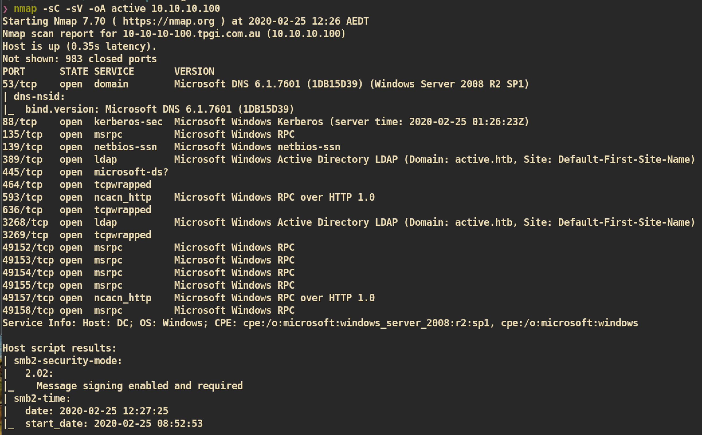
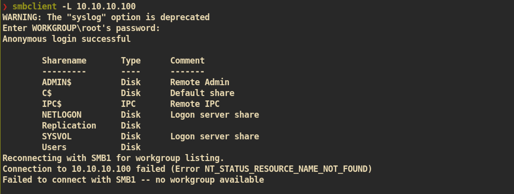
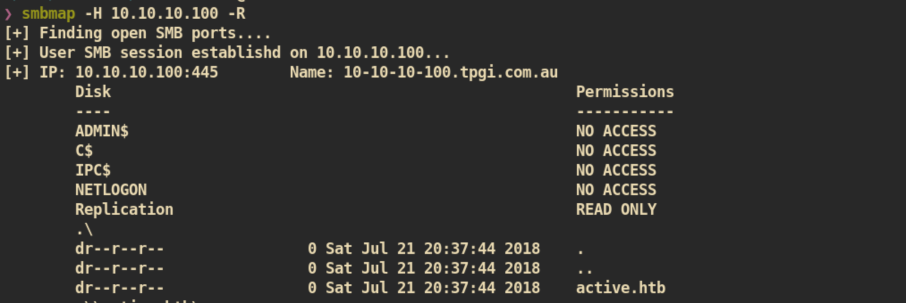
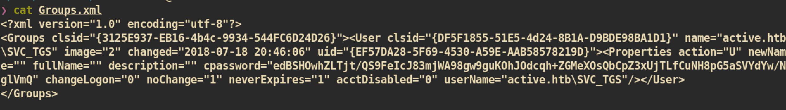
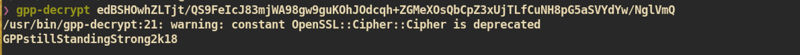
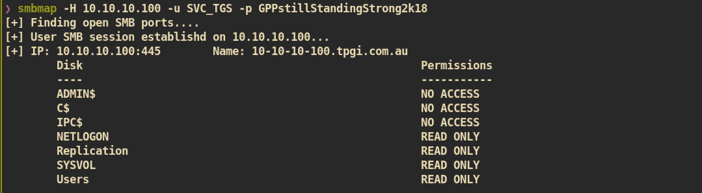
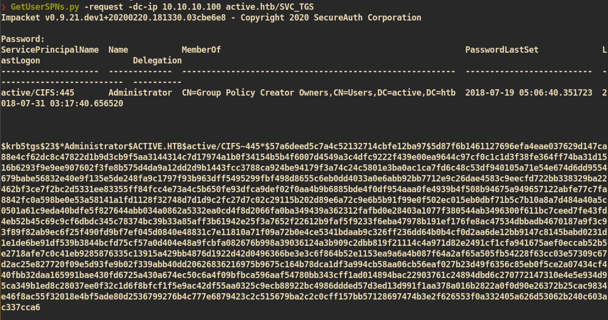
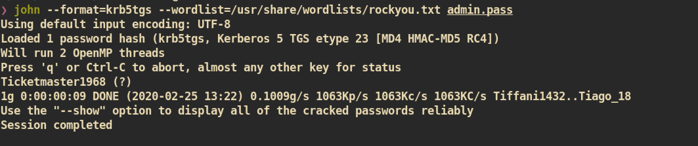
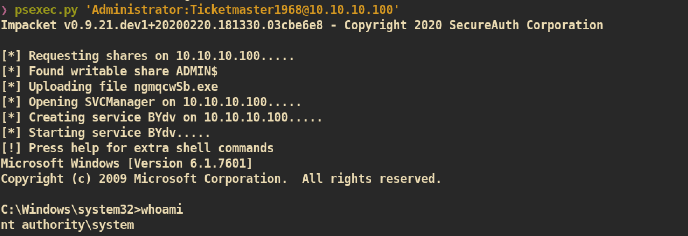

# Active

### Machine Info


#### Nmap



##### SMB Enumeration

Check for SMB share:


Check for SMB share permissions and files/directories if have permission to the share:


`Anonymous` user have `READ ONLY` permission to only `Replication` share. From the share `Replication` we can get `Groups.xml` from group policy:


 Group Policies for account management are stored on the Domain Controller in “Groups.xml” files buried in the SYSVOL folder. From the file we can get passwords set by Group Policy.

`Groups.xml`:


From the `Groups.xml` we can get encrypted password for user `active.htb\SVC_TGS` and the password can be cracked with `gpp-decrypt`:


Check SMB share permission of user `SVC_TGS`:


And from the `Users` share, `SVC_TGS` home directory, I can get `user.txt`:
```
❯ smbclient //10.10.10.100/Users -U SVC_TGS
WARNING: The "syslog" option is deprecated
Enter WORKGROUP\SVC_TGS's password:
Try "help" to get a list of possible commands.
smb: \> cd SVC_TGS\Desktop
smb: \SVC_TGS\Desktop\> dir
  .                                   D        0  Sun Jul 22 01:14:42 2018
  ..                                  D        0  Sun Jul 22 01:14:42 2018
  user.txt                            A       34  Sun Jul 22 01:06:25 2018

                10459647 blocks of size 4096. 4924885 blocks available
smb: \SVC_TGS\Desktop\> get user.txt
getting file \SVC_TGS\Desktop\user.txt of size 34 as user.txt (0.0 KiloBytes/sec) (average 0.0 KiloBytes/sec)
```

#### Privilege Escalation

`Impacket-GetUserSPNS.py`: This help us to get a list of service usernames which are associated with normal user accounts and we can also get a ticket which can be caracked.




Crack the hash:


`psexec.py` to get remote shell:


And you can get `root.txt`
