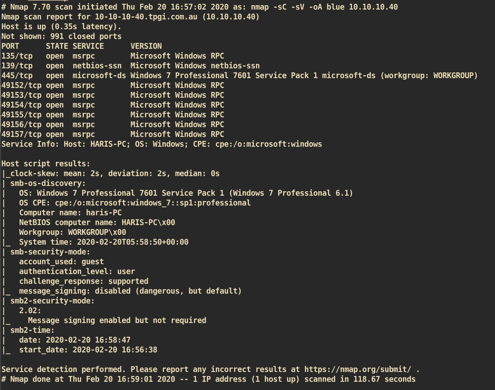
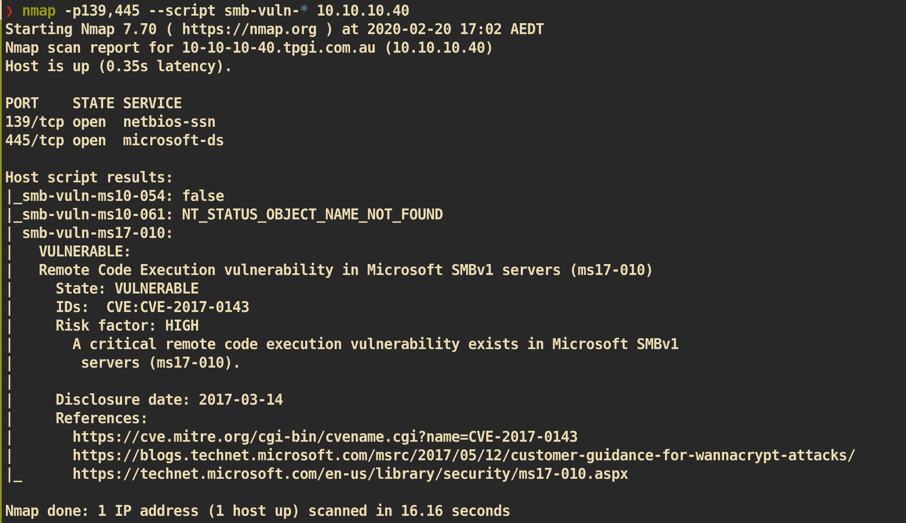
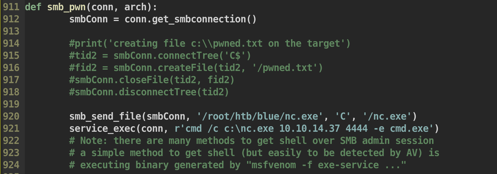
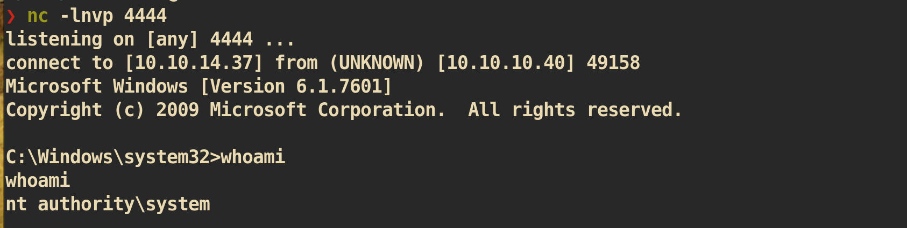

# Blue

### Machine Info


#### Nmap



##### SMB (Port 139, 445)

SMB vulnerability check with nmap:


As we can see from the smb vulnerability check, it has vulnerability `MS17-010` in SMB server.


#### Exploit

Exploit-code: []()https://www.exploit-db.com/exploits/42315

Modification of code:




Execute exploit:
```
~/htb/blue root@kali
❯ cp /usr/share/windows-binaries/nc.exe ./
❯ python MS17-010.py 10.10.10.40
```

`nc` listener on attacking side:


And you can get `root.txt` :)
