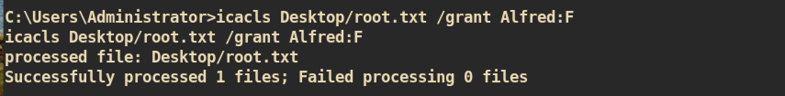

# ChatterBox

#### Machine Info

### Nmap
I couldn't complete nmap scan as it says 12 hours remaining for full_port scan. So I just checked the 2 exploitable ports from others walkthrough.

#### Exploit

Search for public exploits of `AChat`:

I don't know the exact version of `AChat` so I tried to `nc` and access via web browser to port 9255 and 9256 but nothing worked. So I just started with exploit `36025.py`.

The original exploit executes the `calc.exe` so I replaced the shellcode part to spawn reverse shell:

and just execute exploit and check `nc` listener:

#### Privilege Escalation

I found 2 methods to read out `root.txt`. First one is just checking only `root.txt` without root shell and second is spawning a root shell.

##### Method 1

I was able to access to the administrator desktop directory but couldn't open `root.txt` as user `Alfred`. I checked the permission with `icacls`:

We can check that `Alfred` have full access to the directory `Desktop` but have no access to `root.txt`.

What we can do is just changing permission for `root.txt` and user `alfred` can change as he has full access:

After change permission, I can read `root.txt`:

##### Method 2
By using method1, we can check `root.txt` but we cannot have root shell. This method will bring us root shell.

During the enumeration by using [windpeas](https://github.com/carlospolop/privilege-escalation-awesome-scripts-suite/tree/master/winPEAS), I found one auto logon credential:

It shows that username is `Alfred` but when I tried to login to `Administrator` it worked. We can use this credential to get user `administrator` shell.

First just spawn powershell reverse shell using [Nishang](https://github.com/samratashok/nishang) script :

Then create variables with credential and start new process to spawn a new shell:

(shell.ps1 is just copy of Nishang powershell script but it just invokes with different port number (6666))

From the `nc` listener, we can get root shell:

And you can get `root.txt` :)
