# Grandpa

### Machine Info:


#### Nmap:
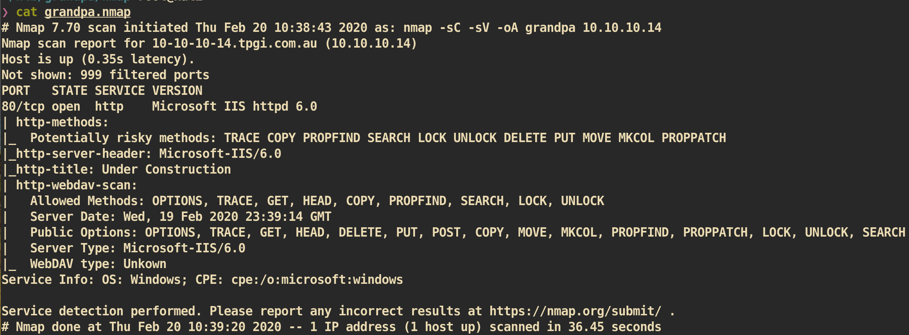


##### HTTP (Port 80)

From the `nmap` scan, we can see that it has `webdav` service in the server. I tried `cadaver` to put my script. I could access as it didn't need authentication but I couldn't upload my file due to permission.

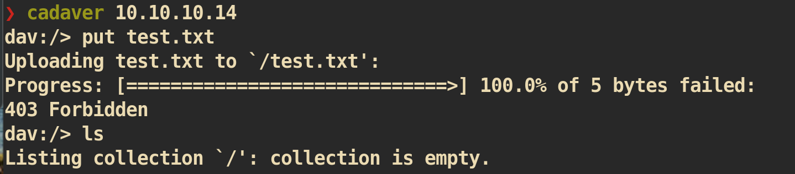

Let's just check if there is a public exploit.

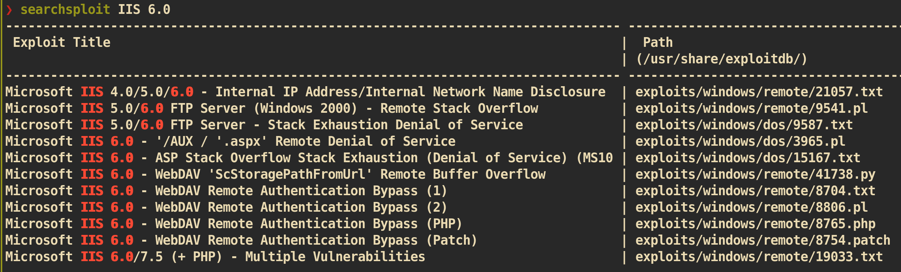

I checked exploit manually and found `41738.py` is what we need.

```
❯ searchsploit -x 41738.py
Description: Buffer overflow in the ScStoragePathFromUrl function in the WebDAV service
in Internet Information Services (IIS) 6.0 in Microsoft Windows Server 2003 R2 allows
remote attackers to execute arbitrary code via a long header beginning with
"If: <http://" in a PROPFIND request, as exploited in the wild in July or August 2016.
```


#### Exploit:
Based on the CVE number of `41738.py`, I found one exploit from github.
```
https://github.com/danigargu/explodingcan
```

Before try with `meterpreter` payload, I tried with non-meterpreter version but failed. I can connect but shell dies immediately. I think this is due to unstable of sever side.

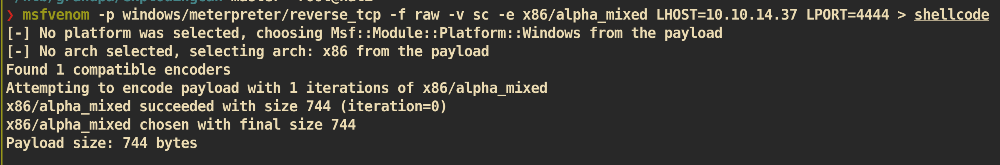

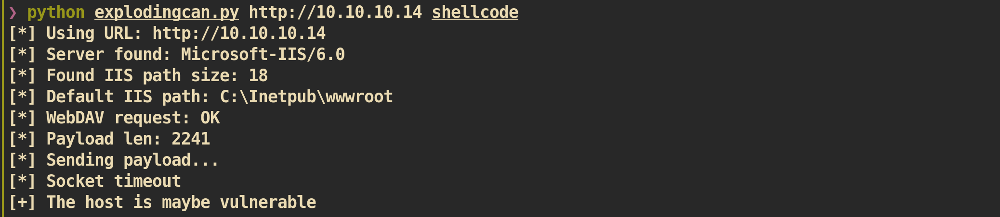

And use `metasploit`:
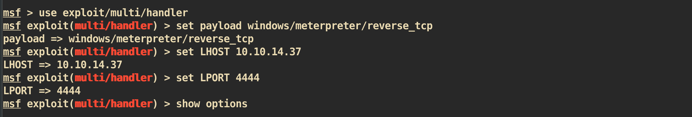

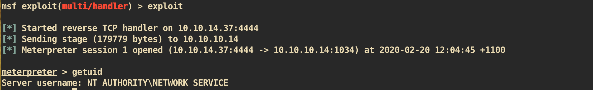


#### Privilege Escalation:

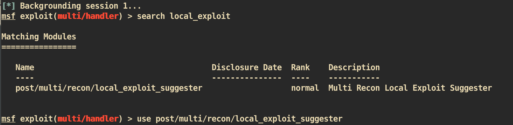

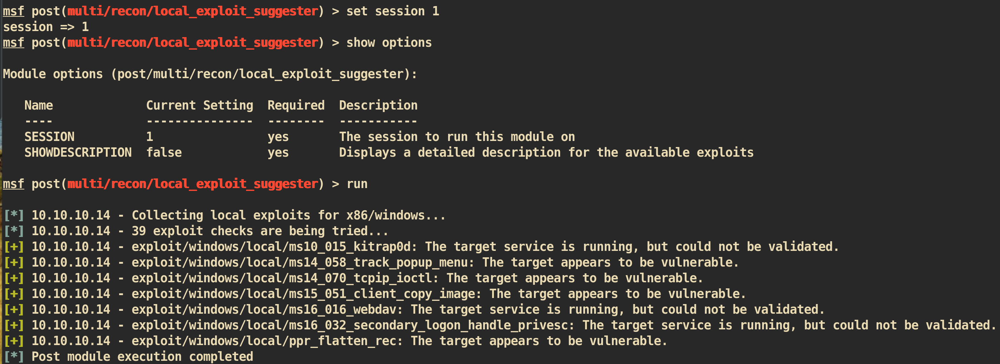


I choose `exploit/windows/local/ms14_070_tcpip_ioctl`.

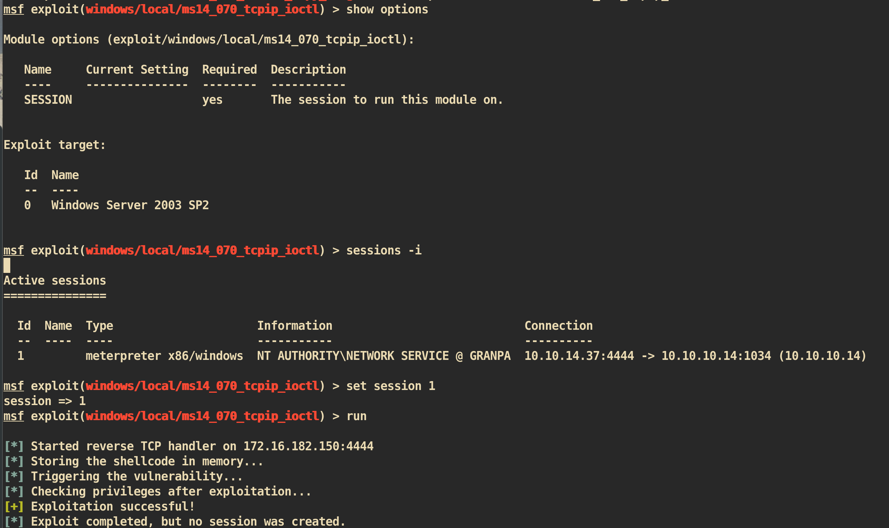

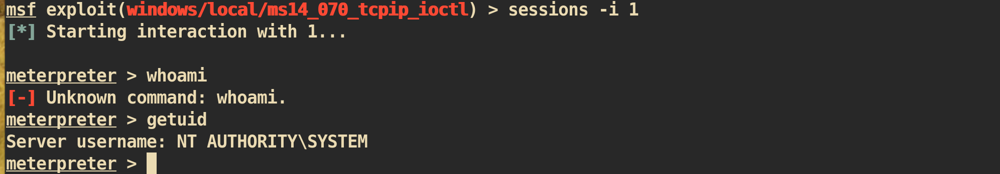

And you can get `root.txt` :)
