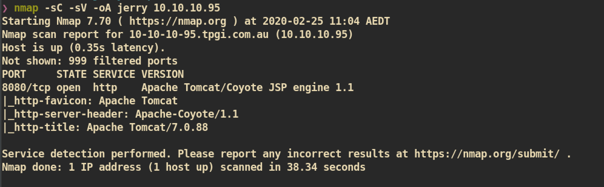
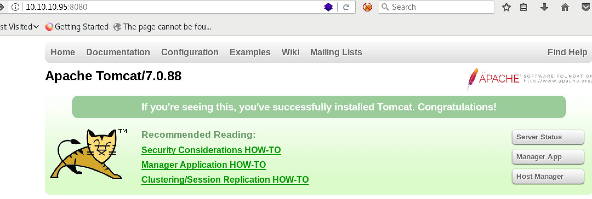
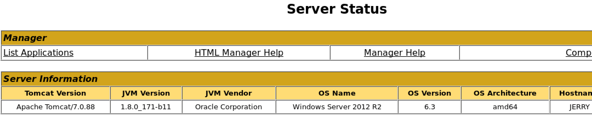
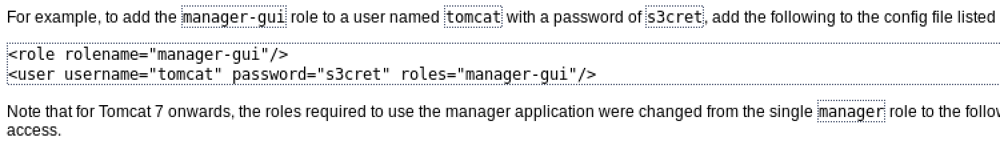
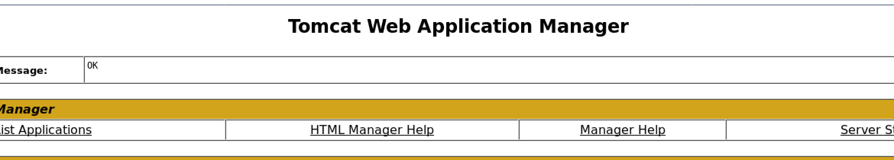
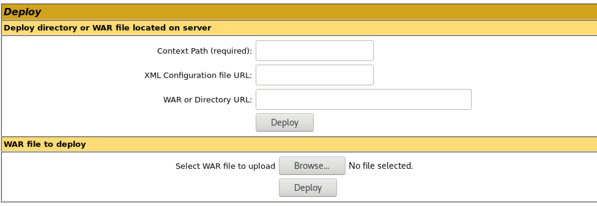
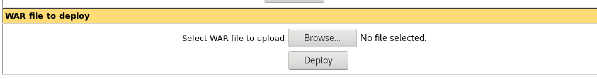
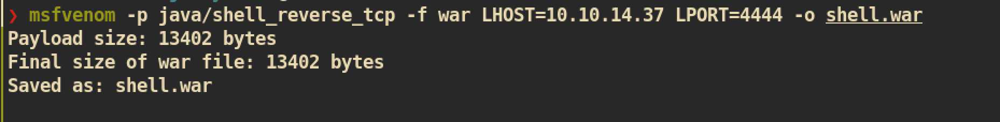
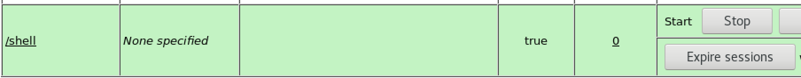
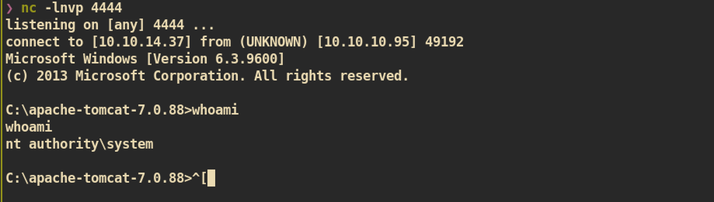

# Jerry

### Machine Info

#### Nmap

##### HTTP (Port 8080)

Index Page: 

From the index page we can check the the version of `Apache Tomcat 7.0.88` and there are 3 links `Server Status`, `Manager App` and `Host Manager` which is for managing tomcat server.

`Server Status`:

This page requires the authentication and credential is `[admin, admin]`. From this page we can check the OS, Architecture, Server Status and Installed applications.

`Manager App`:

This page also requires the authentication and I tried with credential [admin, admin] but failed and get error message. In the error message, it shows how to config for manager user with an example credential, ``[tomcat, s3cret]``. I tried with that credential to login and was successful.

From this page, we can deploy file with `war` extension:

`Host Manager`:

Tried to login this page but failed. I couldn't find any credential for this page.

#### Exploit

The attacker can deploy some malicious file from the `web application manager` and it is vulnerable to `RCE(Remote Code Execution)`.

First create malicious shell file with `war` extension:

And deploy `shell.war` and you can see new path `/shell`:

Now just access to `/shell` page and `nc` listener on attacking side:

And you can get `root.txt` :)
