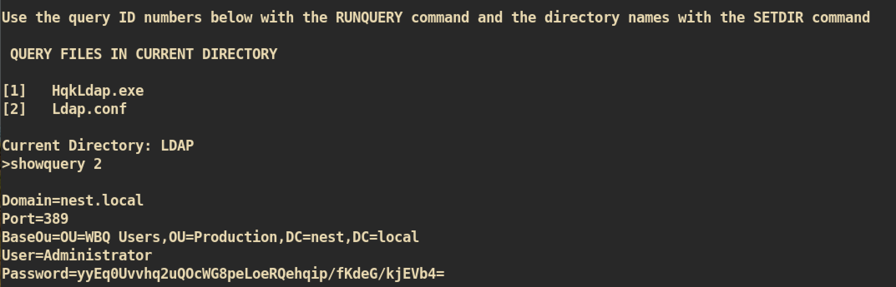

# Nest

### Machine Info


#### Nmap


##### Port 4386
`HQK Reporitng Service v1.2` is running:


Executed and tested commands but nothing interesting and I can't do much thing. I think we need password for debug mode.


##### SMB (Port 445)


I traversed shared directory and found interesting file:


The file includes the `username` and `password`. In the SMB `Users` share, there is a directory `TempUser` and I think I can use this credential to login.


Yes. I can login with `TempUser` and able to check another directory which I wasn't able to check with `anonymous` user.


Again, I enumerated every shared directory and found some interesting files:

Tip: when you enumerate, you can use `mount` to work fast or better


`config.xml`:


`RU_config.xml`:


`RU_Scanner project`:


I enumerated more about `RUScanner` project and found that it has some decrypt/encrypt functions:

`Module1.vb`:


`Utils.vb`:


`Module1.vb` takes `RU_Config.xml` which includes the `username` and `password` and decrypt strings. We need to compile and execute to decrypt encrypted password.

I created simple script based on `Module1.vb` and `Utils.vb` with online compiler:
https://dotnetfiddle.net

```
Imports System
Imports System.Text                                                                                                                                                                                                                                      
Imports System.Security.Cryptography

Public Module Module1

	Public Sub Main()
		Console.WriteLine(DecryptString("fTEzAfYDoz1YzkqhQkH6GQFYKp1XY5hm7bjOP86yYxE="))
		Console.ReadLine()
	End Sub

    Public Function DecryptString(EncryptedString As String) As String                                                                                                                                                                            
        If String.IsNullOrEmpty(EncryptedString) Then                                                                                                                                                                                                    
            Return String.Empty                                                                                                                                                                                                                          
        Else                                                                                                                                                                                                                                             
            Return Decrypt(EncryptedString, "N3st22", "88552299", 2, "464R5DFA5DL6LE28", 256)                                                                                                                                                            
        End If                                                                                                                                                                                                                                           
    End Function                                                                                                                                                                                                                                         

    Public Function Decrypt(ByVal cipherText As String, _                                                                                                                                                                                         
                                   ByVal passPhrase As String, _                                                                                                                                                                                         
                                   ByVal saltValue As String, _                                                                                                                                                                                          
                                    ByVal passwordIterations As Integer, _                                                                                                                                                                               
                                   ByVal initVector As String, _                                                                                                                                                                                         
                                   ByVal keySize As Integer) _                                                                                                                                                                                           
                           As String                                                                                                                                                                                                                     

        Dim initVectorBytes As Byte()                                                                                                                                                                                                                    
        initVectorBytes = Encoding.ASCII.GetBytes(initVector)                                                                                                                                                                                            

        Dim saltValueBytes As Byte()                                                                                                                                                                                                                     
        saltValueBytes = Encoding.ASCII.GetBytes(saltValue)                                                                                                                                                                                              

        Dim cipherTextBytes As Byte()                                                                                                                                                                                                                    
        cipherTextBytes = Convert.FromBase64String(cipherText)                                                                                                                                                                                           

        Dim password As New Rfc2898DeriveBytes(passPhrase, _                                                                                                                                                                                             
                                           saltValueBytes, _                                                                                                                                                                                             
                                           passwordIterations)                                                                                                                                                                                           

        Dim keyBytes As Byte()                                                                                                                                                                                                                           
        keyBytes = password.GetBytes(CInt(keySize / 8))                                                                                                                                                                                                  

        Dim symmetricKey As New AesCryptoServiceProvider                                                                                                                                                                                                 
        symmetricKey.Mode = CipherMode.CBC                                                                                                                                                                                                               

        Dim decryptor As ICryptoTransform                                                                                                                                                                                                                
        decryptor = symmetricKey.CreateDecryptor(keyBytes, initVectorBytes)                                                                                                                                                                              

        Dim memoryStream As IO.MemoryStream                                                                                                                                                                                                              
        memoryStream = New IO.MemoryStream(cipherTextBytes)                                                                                                                                                                                              

        Dim cryptoStream As CryptoStream                                                                                                                                                                                                                 
        cryptoStream = New CryptoStream(memoryStream, _                                                                                                                                                                                                  
                                        decryptor, _                                                                                                                                                                                                     
                                        CryptoStreamMode.Read)                                                                                                                                                                                           

        Dim plainTextBytes As Byte()                                                                                                                                                                                                                     
        ReDim plainTextBytes(cipherTextBytes.Length)                                                                                                                                                                                                     

        Dim decryptedByteCount As Integer                                                                                                                                                                                                                
        decryptedByteCount = cryptoStream.Read(plainTextBytes, _                                                                                                                                                                                         
                                               0, _                                                                                                                                                                                                      
                                               plainTextBytes.Length)                                                                                                                                                                                    

        memoryStream.Close()                                                                                                                                                                                                                             
        cryptoStream.Close()                                                                                                                                                                                                                             

        Dim plainText As String                                                                                                                                                                                                                          
        plainText = Encoding.ASCII.GetString(plainTextBytes, _                                                                                                                                                                                           
                                            0, _                                                                                                                                                                                                         
                                            decryptedByteCount)                                                                                                                                                                                          

        Return plainText
    End Function

End Module                                                                                                               
```                                                                                  

Compile and execute:


Let's try `smbclient` if this is valid or not:


I can login with user `c.smith` successfully and from the `c.smith` directory, I can get `user.txt`.


#### Privilege Escalation
From the `c.smith` directory I can get interesting files:


The text file `Debug Mode Password.txt` looks like empty but it actually has some information about the password:


The data is hidden in the file and this is called `Alternate Data Streams`.

Let's get that hidden data:


`Debug Mode Password.txt`:


The file name is `Debug Mode Password` and found this from `HQK Reporting` directory. In the port `4386`, `HQK Reporting Service` is running and I think it is password for that.


Now we can run additional command `SHOWQUERY` from the service

I just traversed directory and found configuration file:


I got the encrypted password for user `Administrator`.


I tried to encrypt this password with the `C#` script that we used for user `c.smith` but failed. I think it needs some modification.

Let's just decompile the `HqkLdap.exe` that we got from user `c.smith`. I copied `exe` file to my local machine (mac) and decompiled with `visual code`.


I just checked source code and realised that it has very similar syntax and struct with that we used to decrypt user `c.smith`. So I just changed the `plaintext, passPhrase, saltValue, passwordIterations and initVector` from script.

```
----------------------- SIP ---------------------
Public Sub Main()

		Console.WriteLine(DecryptString("yyEq0Uvvhq2uQOcWG8peLoeRQehqip/fKdeG/kjEVb4="))
        Console.ReadLine()
	End Sub
	Public  Function DecryptString(EncryptedString As String) As String
        If String.IsNullOrEmpty(EncryptedString) Then
            Return String.Empty
        Else
            Return Decrypt(EncryptedString, "667912", "1313Rf99", 3, "1L1SA61493DRV53Z", 256)
        End If
    End Function
----------------------- SIP ---------------------
```

And execute script from online compiler:


Now it's time to get admin shell with `psexec.py`:


We are `nt authority\system` and you can get `root.txt` :)
