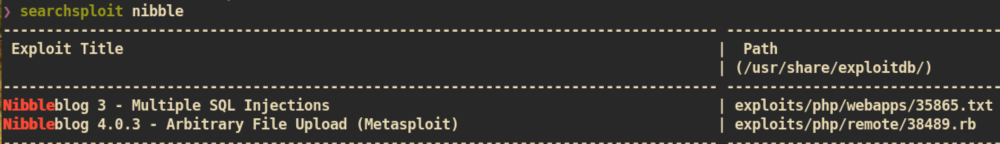
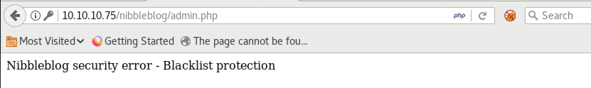

# Nibbles

### Mahchine Info


#### Nmap


##### HTTP (Port 80)

Index page:


Index page source code:


Access to `10.10.10.75/nibbleblog/`:


###### Gobuster
`Gobuster` to find out hidden page/directory:


`nibbleblog/admin.php`:

I tried common password for admin and root but not worked.

`nibbleblog/README`:</br>
From this page, I can check the version of `nibbleblog`.


Check for public exploit:


There is a one meatsploit version exploit for `Nibbleblog 4.0.3` and it is vulnerable to `Arbitrary File Upload`. I checked the exploit but it requires authenticated user. We have to find the `username` and `password`.

I looked up every pages I found from `gobuster` but I couldn't find credentials. Maybe we need to brute-force or just guessing:


After a few try manually I got this error message which means we cannot use tools such as `hydra` for brute-forcing.

I tried many credentials and finally found one => `[admin, nibbles]`:


#### Exploit
Now we have credential and we can try the exploit what we found from `exploit-db`. Instead of using `metasploit`, I just followed the step based on exploit as it looks like very simple

First just check if `my_imag` plugin is installed:</br>
`http://10.10.10.75/nibbleblog/admin.php?controller=plugins&action=config&plugin=my_image`


Create php reverse shell or you can just copy from share directory:
```
❯ cp /usr/share/webshells/php/php-reverse-shell.php ./
```
And just change `ip` and `port` from script.


Now we need to just upload and execute:


Access to `image.php`


`nc` listener on attacking side:


#### Privilege Escalation

Spawn tty and check for `sudo` privilge:


In the user `nibbler` home directory, there is a zip file `personal.zip`. Let's just unzip and enumerate:


So user can execute `/home/nibbler/personal/stuff/monitor.sh` with root privilege.

##### Exploit


Create and execute malicious `monitor.sh`:


And you can get `root.txt` :)
