# Node

### Machine Info
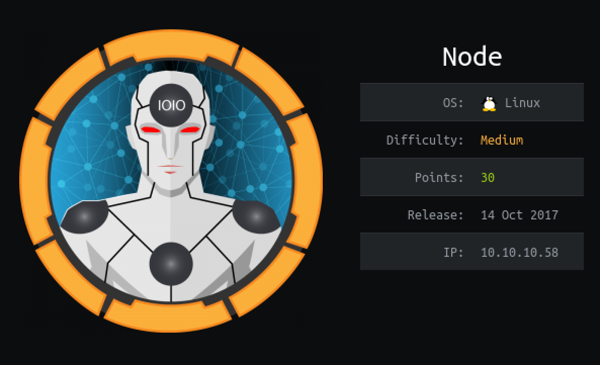

#### Nmap
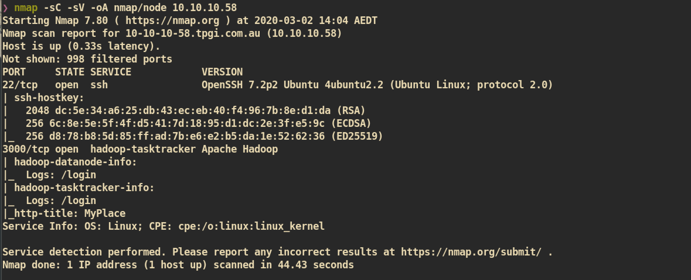

##### HTTP (Port 3000)

Index Page:
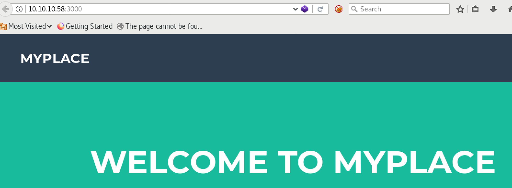

Login Page:
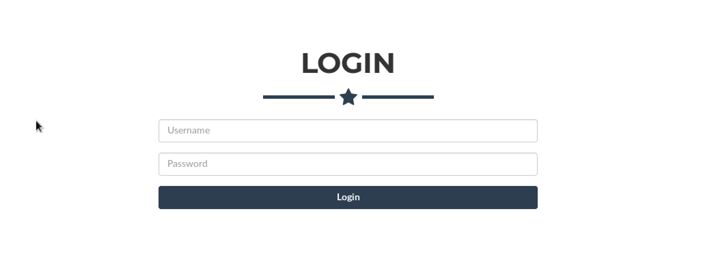

First I checked the source code and found some credentials from `js` sources.

`/api/users`:
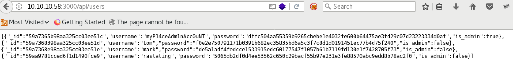

`/api/users/latest`:
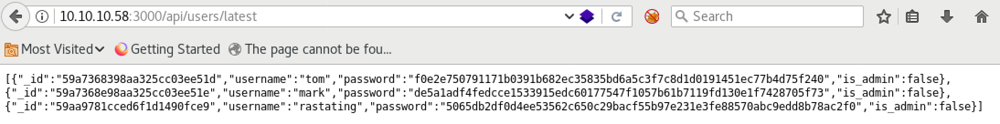

I decoded hashes from online decoder, `crackstation`, and got password for admin user `myp14ceadm1nacc0unt`. I tried to login with credential and I was able to:

Password for admin user is `manchester`:
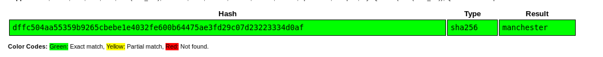

Successfully logged in:
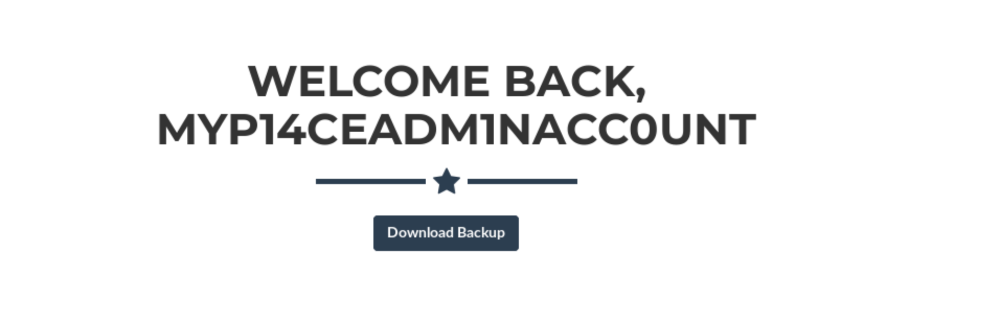

From the admin page, I could download backup file. The downloaded file is `base64` encoded file and it is huge. Let's decode and check again:
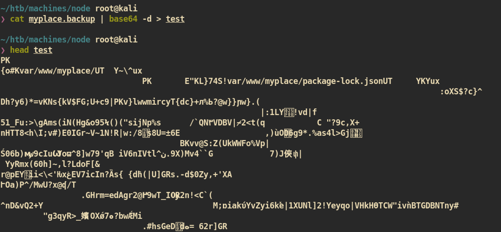

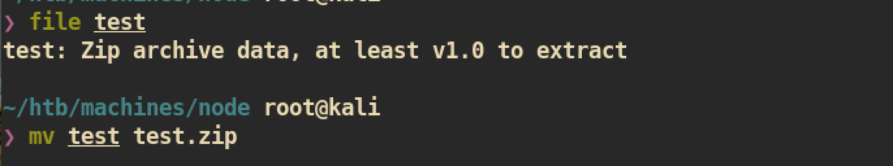

The decoded file is `zip` archive data and I just tried to unzip the file to check data:
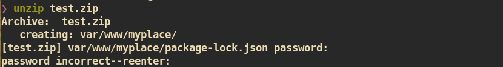

The file requires password to unzip. I wasn't able to get some password during enumeration and admin password that I used in login step was useless. Only option left is brute-forcing:

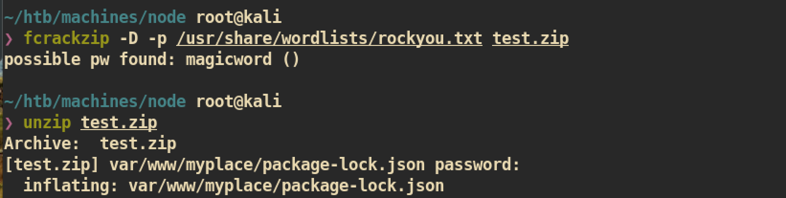

I could get password by brute-forcing and unzipped successfully.


The backup files look like just back up for whole directory of `/var/www/html`. There are many files and I got some interesting file which includes the password and username for `mongodb` database:

`app.js`:
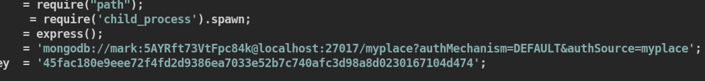

And I just tried `ssh` to user mark with that credential and it worked:
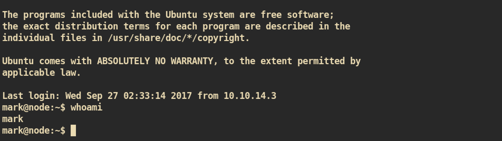

#### User Mark to User Tom

During enumeration I found one binary file `/usr/local/bin/backup` which looks like very interesting but I couldn't do change or read due to lack of permission:
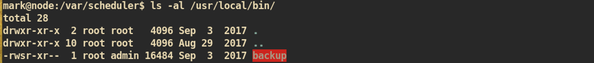
I think this file can be used for root privilege escalation.


I found that there are 2 processes of `Tom`, `/var/scheduler/app.js` and `/var/www/myplace/app.js`.
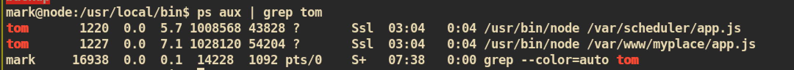

First I checked the `/var/www/myplace/app.js` and it was just same as we got from the backup directory. Then I checked the other one and it was about the scheduling job in mongodb:
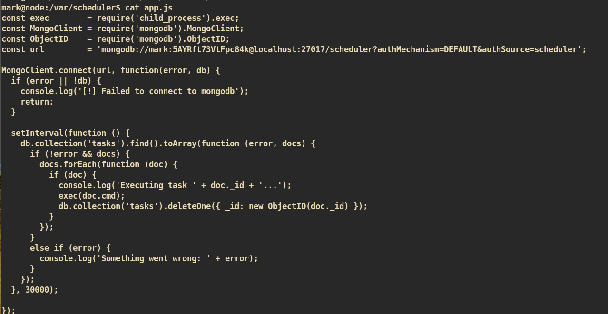

This seems like we can add some job and the job will be executed.

##### Exploit

The user `tom` is in the group `admin` and we can add job and executes with user `tom` privilege.


###### First try:</br>
Let's just copy `/bin/bash` to `/tmp` with changing permission:
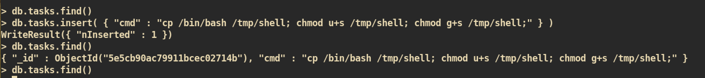

I was able to get a shell but I wasn't able to execute or run binary `backup` because I wasn't in the group `admin` even I was user `tom`.


###### Second Try:</br>
I successfully got the shell and I am user `tom` and in the group `admin`.
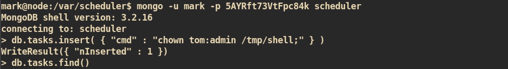
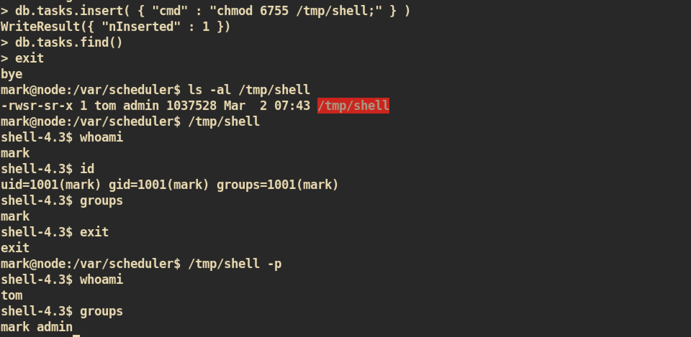


#### User To Root Privilege Escalation

From the `app.js` that I got from backup directory of admin page, I can check the usage of `/usr/local/bin/backup`:
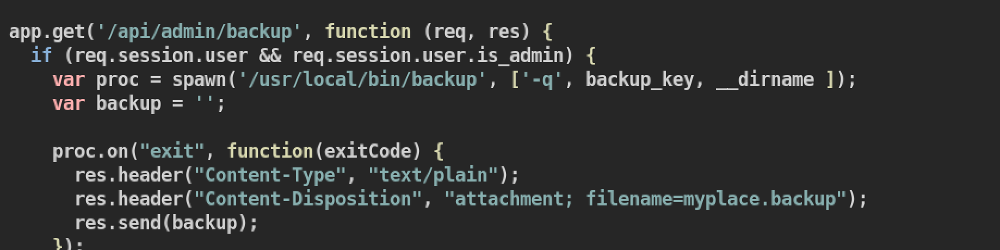

It requires arguments for `backup_key` and `dirname`. The `backup_key` is constant and it is `45fac180e9eee72f4fd2d9386ea7033e52b7c740afc3d98a8d0230167104d474`. We just need to change of directory name that we want to back-up.

##### Exploit

###### First Try

```
/usr/local/bin/backup -q 45fac180e9eee72f4fd2d9386ea7033e52b7c740afc3d98a8d0230167104d474 /root
```

Decode and unzip like we did before and I got:
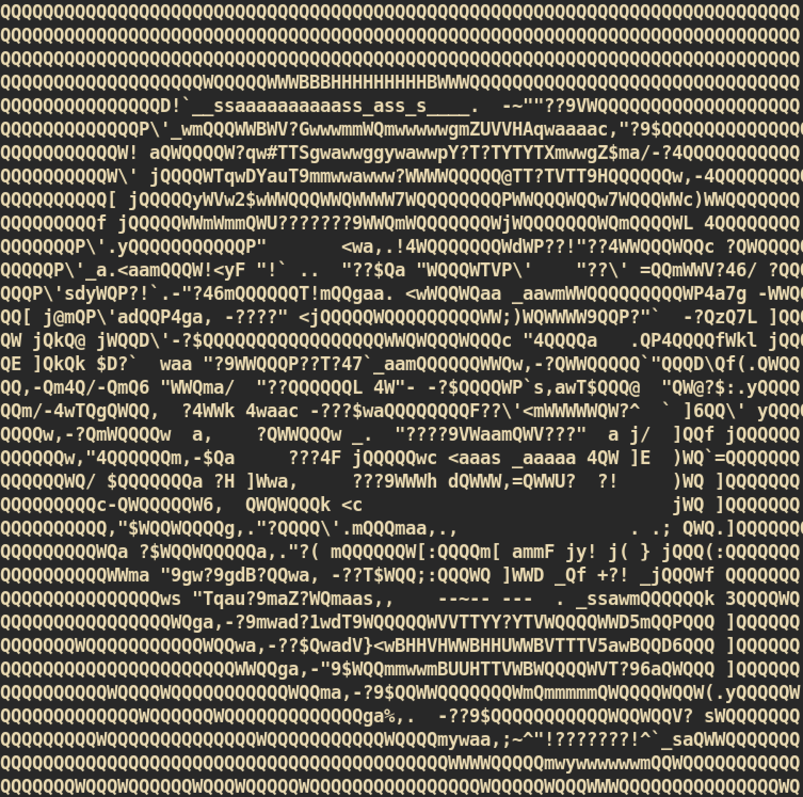

I think if we do something wrong, we will get that face :(


###### Second Try

I just copied the `backup` binary to my machine and debugged:
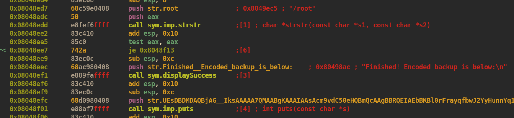

As we can see it checks for string `/root` from `encoded` backup hash. There are more bad characters, `..`, `.`, `/`, `;`, `&`, and if it includes these characters it will not encoded correctly and we will get that face.

Command:
```
/usr/local/bin/backup -q 45fac180e9eee72f4fd2d9386ea7033e52b7c740afc3d98a8d0230167104d474 root

```

Decode and unzip:
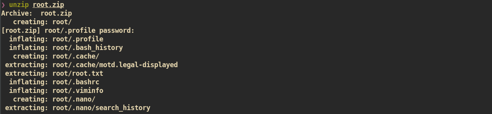

WE CAN GET `root.txt` but no shell.


###### Third Try

I can get `root.txt` but I want to get a root shell. I debugged again to get a shell:

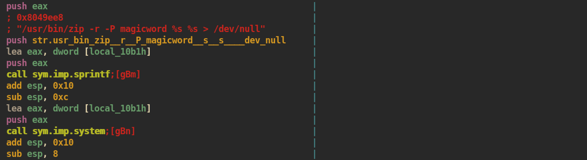

The command `/usr/bin/zip` takes 3 arguments and it will be executed via `system()` function as we can see. The `system()` allows a new line so maybe we can do command injection to catch a shell:

I added 'b' after `/bin/bash` because if we do not add, the `/dev/null` will be on the `/bin/bash`.
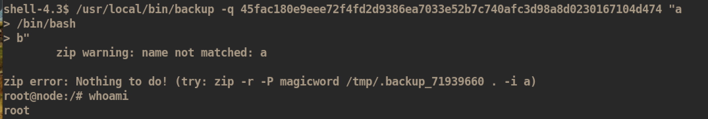

And you can get `root.txt` :)
