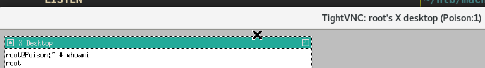

# Poison

### Machine Info

#### Nmap

##### HTTP (Port 80)

Index Page:

From the index page I can look up some script files:

`listfiles.php`:

`pwdbackup.txt`:

`/etc/passwd`: 
I can access to this file as this application is vulnerable to `LFI(Local File Inclusion)`. Just access to file `../../../../../../../etc/passwd`

###### Exploit

Decrypt `pwdbackup.txt` password with `base64`:

As we have to decrypt 13 times, I just created simple bash script.

And this returns passwd:

From the `/etc/passwd` we already checked that there is user `charix` and password includes string `Charix`. Let's just ssh to `charix`:

we are user `charix` now.

#### Privilege Escalation

There is a zip file `secret.zip` in home directory:

Transfer to my local machine and unzip with password `Charix!2#4%6&8(0`:

This returns non-ascii character file. Just leave it because we don't know what it is.

Check for `netstat`:

There are 2 suspicious ports, `5901` and `5801`, as these ports are usually used for `vnc` service.

Check for process `ps`:

There is a vnc process and it is running with `root`.

##### Exploit

First make dynamic port forwarding:

`/etc/proxychains.conf`:

And execute `vncviewer` with proxychains: 

At first try, I failed as it requires password for root. So I just try with password file that we got from user home directory and it worked.

`vncviewer` root shell:

And you can get `root.txt` :)
