# Postman

### Machine Info
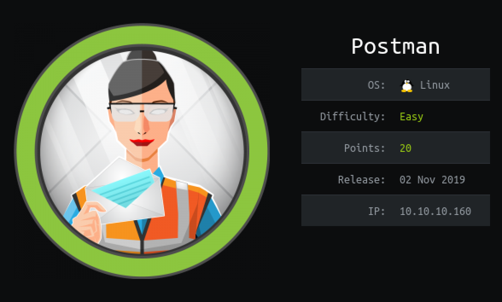

#### Nmap
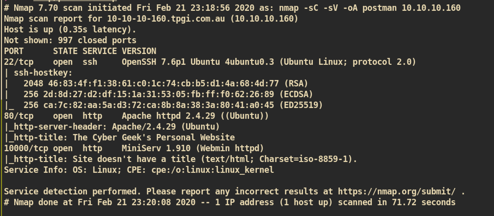


##### HTTP (Port 80)

Access to Index page:
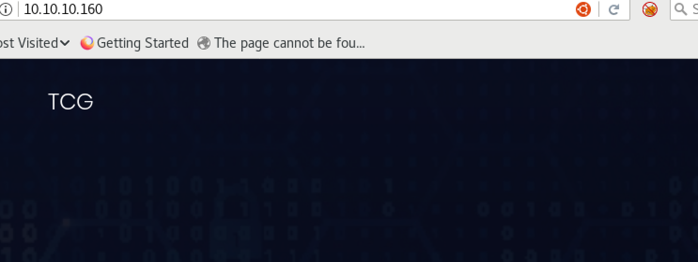

Gobuster:
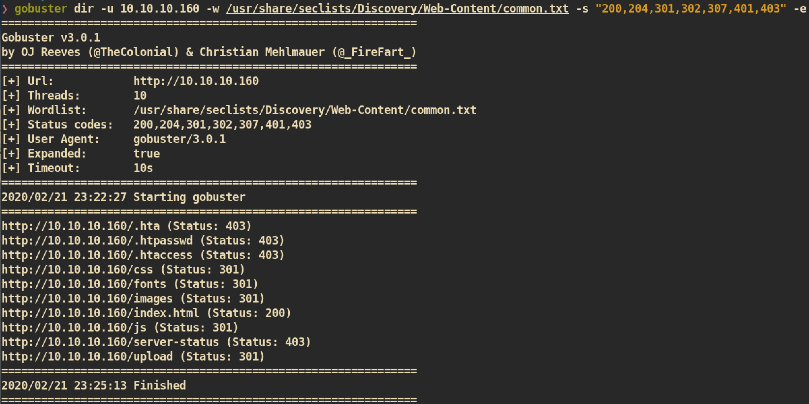

I enumerated more but I got nothing from HTTP port.


##### Webmin (Port 10000)

`Miniserv (Webmin 1.910)` is running in the server.

Login Page:
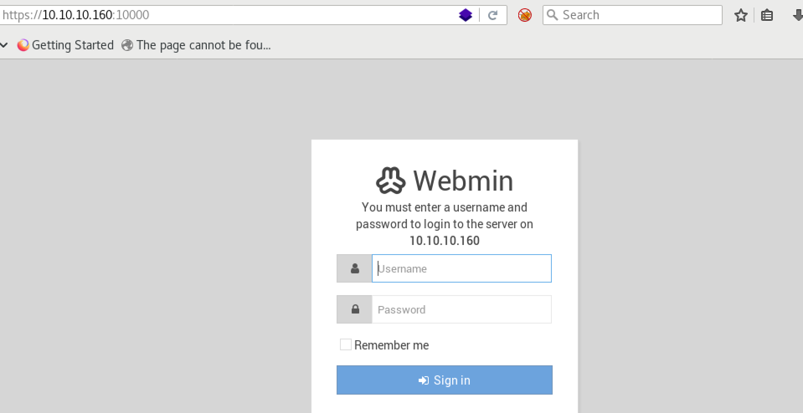

I tried to login but failed. (Tried login with common/default credentials).

Check for vulnerability:
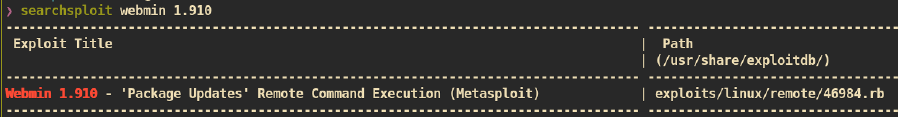

I read the exploit but it requires credentials so we cannot use this.


#### Nmap full port scan
During I enumerate for port `80` and `1000`, I just run another `nmap` scan against full port `1-65535` and I get new port `6379`.

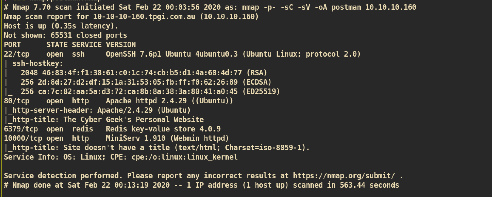


##### Redis key-value store (Port 6379)

Redis: </br>
Redis is an in-memory non-relational key-value store. This means that it stores data based on keys and values — think of it as a giant dictionary that uses words and their definitions to store information. The keys (or words) are required in order to retrieve their values (definitions).

First I just access to port 6379 via web browser:
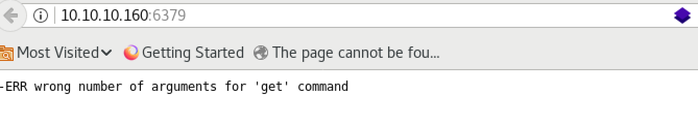

And check for if there is a public exploit for version `4.0.9`:
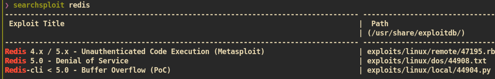

It is likely to be vulnerable to `Unauthenticated Code Execution`.

I can use `metasploit` but I rather prefer `non-metasploit` method. Let's check for if there is a `non-metasploit` version from google.

Exploit-code: []() https://github.com/Avinash-acid/Redis-Server-Exploit/blob/master/redis.py

`redis-cli` command to check out home directory of user `redis`:
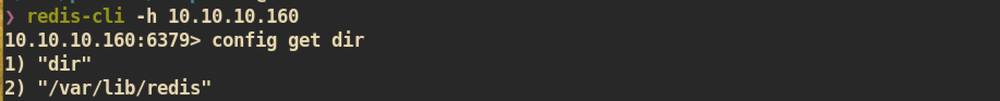

And make some modification of exploit code based on result of above command:


#### Exploit
```
❯ python exploit.py 10.10.10.160 redis
        *******************************************************************
        * [+] [Exploit] Exploiting misconfigured REDIS SERVER*
        * [+] AVINASH KUMAR THAPA aka "-Acid"                                
        *******************************************************************


         SSH Keys Need to be Generated
----------------- SIP -----------------
Keys Generated Successfully
OK
OK
OK
OK
OK
OK
You'll get shell in sometime..Thanks for your patience
```

After a few seconds we can get a shell of user `redis`:
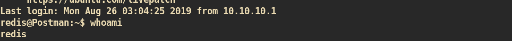


#### Escalate to normal user
I checked `/etc/passwd` and found the home directory of user `matt` which means we need to get a shell of user `matt` to get `user.txt`. Let's enumerate.

I just transferred simple enumeration script `lse.sh` and execute:
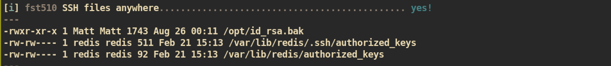

From the result, we can check that there is a interesting file `/opt/id_rsa.bak`. The file can be read by anyone and the owner is `Matt`.

`/opt/id_rsa.bak`:
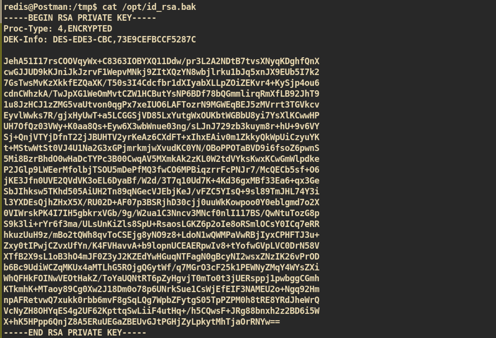

I think this is the backup private key for user `Matt` which is protected with paraphrase. Time to crack with `john`.

Copy the key and crack:
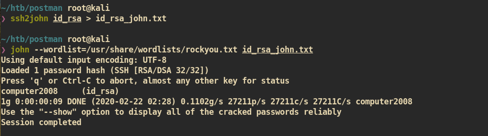

And ssh with `id_rsa` and paraphrase key `computer2008`:
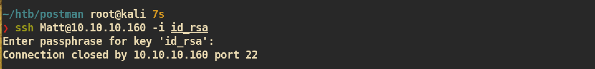


This is not working and I think we cannot ssh. We need another way in. Let's just use that paraphrase key as normal password.

From the user `redis` shell => `su Matt`:


This worked :)


#### Privilege Escalation to root

I enumerated and found that miniserv is running with root permission:
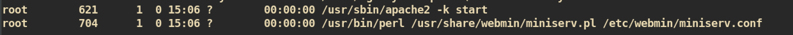

And I just try to login with user `Matt` and password `computer2008` to the webmin page and it worked:
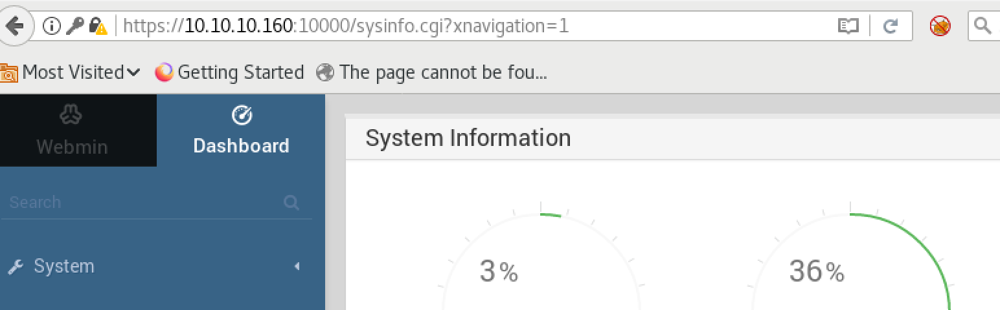

I couldn't try webmin exploits because I didn't have any credentials at that time. But now I have one which means I can try webmin exploit and get a root shell.

I found this good exploit from github: []()https://github.com/roughiz/Webmin-1.910-Exploit-Script

##### Exploit
Execute exploit:
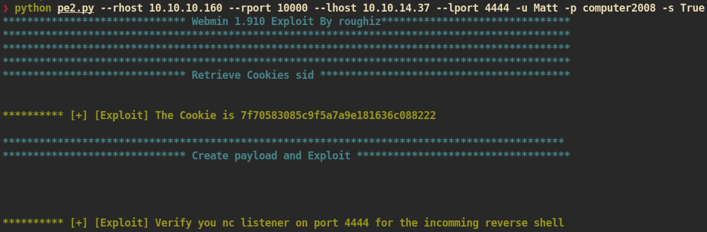

`nc` listener on attacking side:
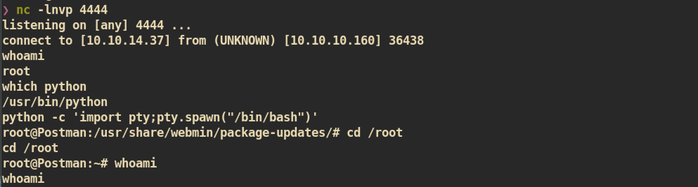

And you can get `root.txt` :)
