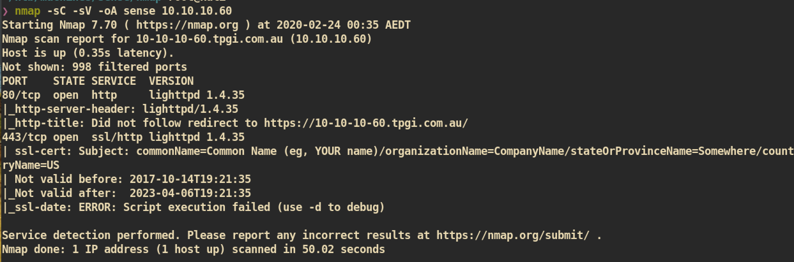
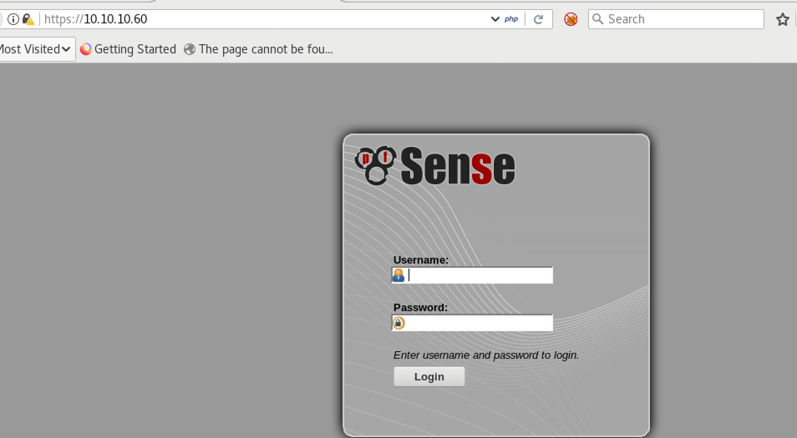
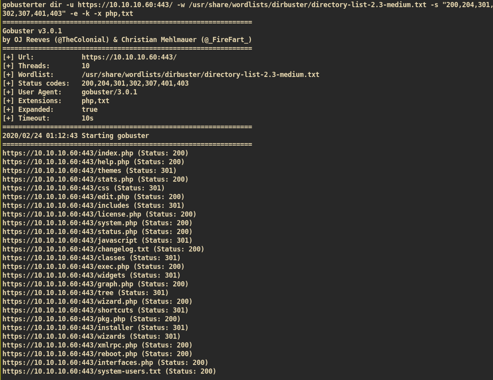
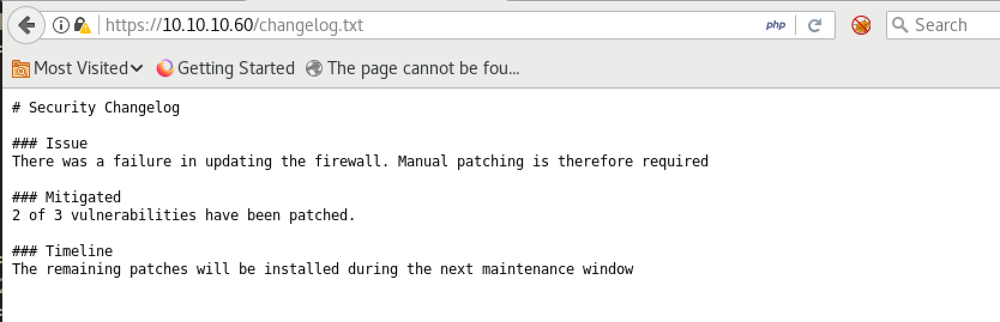
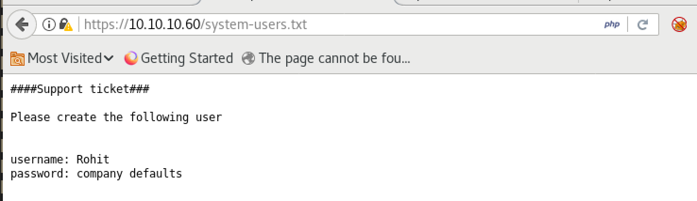
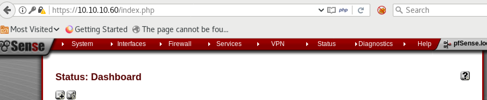
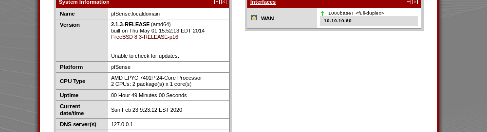
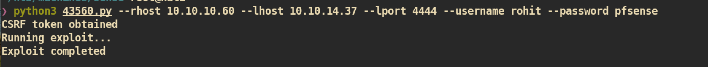
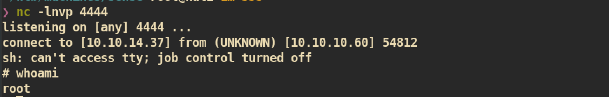

# Sense

### Machine Info

#### Nmap

##### HTTP (Port 80)
When I access to port 80 it redirects to https server (port443).

##### HTTPS (Port 443)
Index Page:

I tried to login with default/common credentials but couldn't login.

###### Gobuster

Changelog.txt:

system-users.txt:

This looks like the credential for the `pfsense` page.

Login to `pfsense`:
Credential => (rohit, pfsense)

From the dashboard we can check some information:

`pfsense` version 2.1.3 is running.

#### Exploit

I searched for `pfsense version 2.1.3` and found one public exploit from exploit-db:

Exploit-code: https://www.exploit-db.com/exploits/43560

We don't need to make some change to the exploit code and just need to execute:

`nc` listener on attacking side:

And you can get `root.txt` :)
