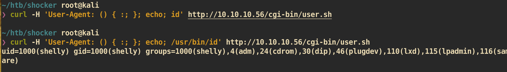

# Shocker

### Machine Info

#### Nmap

##### HTTP (Port80)

Access to the page `10.10.10.56`:

Checked the source code but nothing.

###### Gobuster

`gobuster` to check out web server directory:

There is only one interesting directory `/cgi-bin/`. Rung `gobuster` against `/cgi-bin` directory.

There is a bash file `user.sh` in directory `/cgi-bin/` and it shows the result after execute script. This is likely to be vulnerable to `shellshock`.

###### Check shellshock with Nmap

It says it is vulnerable to `shellshock`.

##### Exploit

Shellshock_PoC: https://github.com/mubix/shellshocker-pocs

Based on CVE I just modified code little bit and execute to check `id`:

It is working and it is vulnerable to `shellshock`.

Reverse shell:

`nc` listenere on attacking side:

#### Privilege Escalation

Check for `sudo` privilege:

user `shelly` can run `/usr/bin/perl` with `root` privilege.

##### Exploit

Spawn new shell with perl:

And you can get `root.txt` :)
